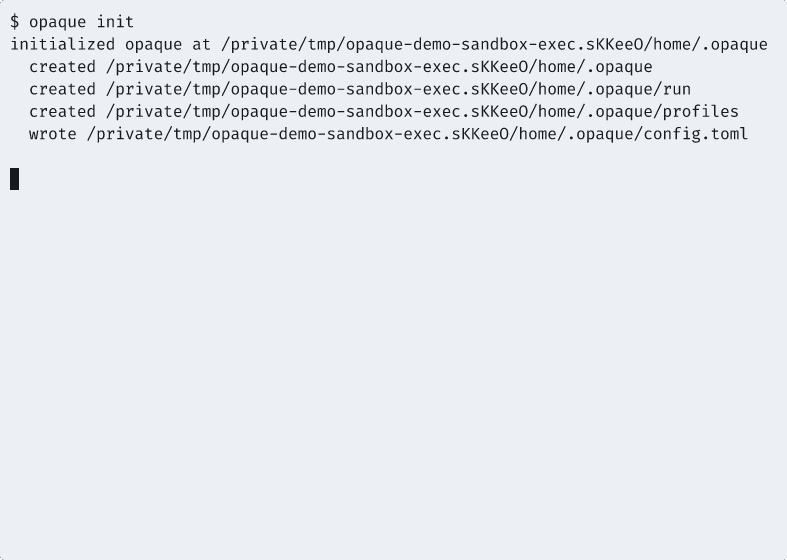

# Opaque

[](LICENSE)

Local approval-gated secrets broker for AI coding tools (Codex, Claude Code, etc) that must not disclose plaintext secrets to LLM context.

## What It Does

Opaque sits between your AI coding assistant and your secrets. LLMs get **operations** (e.g., "set this GitHub secret"), never plaintext values. Every operation passes through:

**Policy → Approval → Execute → Sanitize → Audit**

## Features

- Deny-by-default policy engine with allowlist rules
- Client identity from Unix peer creds + executable identity (path/hash, optional macOS Team ID)
- Operation-bound native OS approvals (macOS Touch ID, Linux polkit)
- Typestate-enforced response sanitization + secret-pattern scrubbing
- Structured audit events (SQLite) with correlation IDs
- MCP server for Claude Code integration
- Providers: GitHub secrets, 1Password, Bitwarden Secrets Manager
- Policy presets for common workflows

## Install (From Source)

```bash
cargo build --release
```

Binaries:

| Binary | Role |
|--------|------|
| `opaqued` | Trusted daemon (enclave, policy, approvals, audit) |
| `opaque` | CLI client |
| `opaque-mcp` | MCP server for Claude Code |

## Quickstart: Claude Code (MCP)

1. Initialize with a preset:
   ```bash
   opaque init --preset github-secrets
   ```

2. Start the daemon:
   ```bash
   opaqued
   # Or install as a service: opaque service install
   ```

3. Add to your Claude Code MCP config:
   ```json
   {
     "mcpServers": {
       "opaque": {
         "command": "/path/to/opaque-mcp"
       }
     }
   }
   ```

4. Ask Claude Code to sync a secret:
   > "Set the GitHub Actions secret API_KEY for myorg/myrepo using my keychain"

Full MCP docs: `docs/mcp-integration.md`

## Quickstart: Codex / CLI

1. Initialize with a preset:
   ```bash
   opaque init --preset github-secrets
   ```

2. Start the daemon:
   ```bash
   opaqued
   ```

3. Test connectivity:
   ```bash
   opaque ping
   opaque execute test.noop
   ```

Optional: run your agent through Opaque wrapper mode (session-scoped):

```bash
opaque agent run -- codex
```

4. Sync a GitHub secret:
   ```bash
   opaque github set-secret \
     --repo myorg/myrepo \
     --secret-name API_KEY \
     --value-ref keychain:opaque/api-key
   ```

5. Build a refs-only manifest from `.env.example` and publish through Opaque:
   ```bash
   opaque github build-manifest \
     --env-file .env.example \
     --value-ref-template 'bitwarden:production/{name}' \
     --out .opaque/env-manifest.json
   ```

   Manually edit `.opaque/env-manifest.json` if any refs need adjustment, then publish:
   ```bash
   opaque github publish-manifest \
     --repo myorg/myrepo \
     --manifest-file .opaque/env-manifest.json
   ```

6. Review the audit log:
   ```bash
   opaque audit tail --limit 10
   opaque audit tail --query github --limit 10
   ```

Full CLI docs: `docs/getting-started.md`

## Policy Presets

Get started quickly with built-in presets:

```bash
opaque policy presets                        # list available presets
opaque init --preset safe-demo               # test.noop only (safe to experiment)
opaque init --preset github-secrets          # GitHub secret sync for agents
opaque init --preset sandbox-human           # sandbox exec for humans only
opaque init --preset agent-wrapper-github    # wrapped-agent GitHub sync with session enforcement
```

Or apply a preset to an existing config:

```bash
opaque policy preset github-secrets
```

## Demos

### Enclave Quickstart (Init, Policy, Daemon, Execute, Audit)


### Sandboxed Exec (Captured stdout/stderr)



## Docs

- Docs index: `docs/README.md`
- Getting started: `docs/getting-started.md`
- MCP integration: `docs/mcp-integration.md`
- Bitwarden setup: `docs/bitwarden.md`
- Policy: `docs/policy.md`
- Operations: `docs/operations.md`
- LLM harness: `docs/llm-harness.md`
- Demos: `docs/demos.md`
- Deployment: `docs/deployment.md`
- Security assessment: `docs/security-assessment.md`
- Deferred roadmap: `docs/roadmap-deferred.md`

## Deferred

See `docs/roadmap-deferred.md`. Notably:

- HashiCorp Vault connector
- GitLab CI variable sync
- iOS approvals / FaceID (v3)
- FIDO2 / WebAuthn approvals (v3)

## License

Apache-2.0. See [LICENSE](LICENSE).
