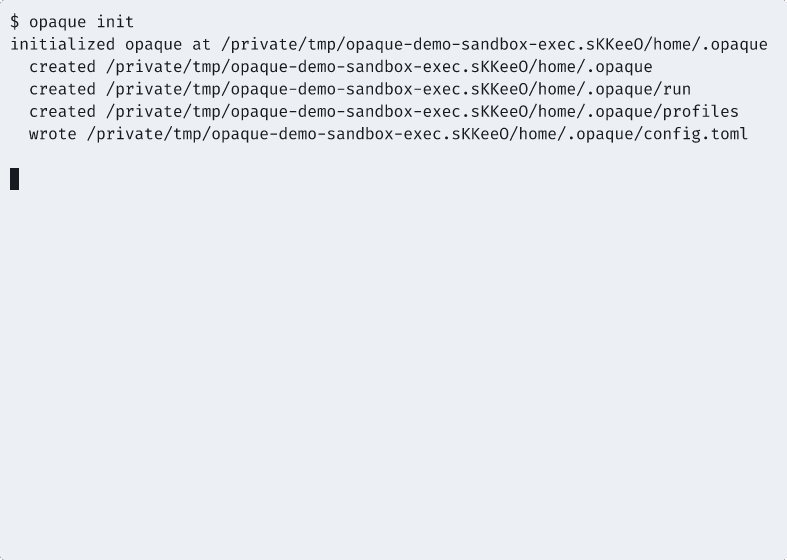

# Opaque


[](LICENSE)


Local approval-gated secrets broker for AI coding tools (Codex, Claude Code, etc) that must not disclose plaintext secrets to LLM context. Current alpha scope is macOS/Linux desktop sessions.

## What It Does

Opaque sits between your AI coding assistant and your secrets. LLMs get **operations** (e.g., "set this GitHub secret"), never plaintext values. Every operation passes through:

**Policy -> Approval -> Execute -> Sanitize -> Audit**

## Alpha Scope (Launch)

In scope for the current alpha:
- macOS and Linux desktop-session deployments
- operation-bound approvals (Touch ID on macOS, polkit on Linux)
- provider operations for GitHub, GitLab, 1Password, Bitwarden, Vault, and AWS Secrets Manager

Out of scope for alpha:
- iOS approvals / APNs push
- FIDO2 / WebAuthn approvals
- headless/SSH-only/container-only approval flows

## Features

- Deny-by-default policy engine with allowlist rules
- Client identity from Unix peer creds + executable identity (path/hash, optional macOS Team ID)
- Operation-bound native OS approvals (macOS Touch ID, Linux polkit)
- Typestate-enforced response sanitization + secret-pattern scrubbing
- Structured audit events (SQLite) with correlation IDs
- MCP server for Claude Code integration
- Providers: GitHub secrets, GitLab CI variables, 1Password, Bitwarden Secrets Manager, HashiCorp Vault, AWS Secrets Manager, Azure Key Vault, GCP Secret Manager
- Policy presets for common workflows

## Install

### macOS (Homebrew)

```sh
brew install kcirtapfromspace/tap/opaque
```

### Linux / macOS (shell script)

```sh
curl -fsSL https://opaque.info/install.sh | sh
```

### From Source

```sh
cargo install --git https://github.com/kcirtapfromspace/opaque.git \
  opaque opaqued opaque-mcp opaque-approve-helper opaque-web
```

Binaries:

| Binary | Role |
|--------|------|
| `opaqued` | Trusted daemon (enclave, policy, approvals, audit) |
| `opaque` | CLI client |
| `opaque-mcp` | MCP server for Claude Code |
| `opaque-approve-helper` | Native approval helper binary (platform integration) |
| `opaque-web` | Local web dashboard for audit and status views |

## Platform Support

| Platform | Architecture | Status |
|----------|-------------|--------|
| macOS | Apple Silicon (aarch64) | Fully supported |
| macOS | Intel (x86_64) | Fully supported |
| Linux | x86_64 | Fully supported |
| Linux | aarch64 | Fully supported |

## Quickstart: Claude Code (MCP)

1. Initialize with a preset:
   ```bash
   opaque init --preset github-secrets
   ```

2. Start the daemon:
   ```bash
   opaqued
   # Or install as a service: opaque service install
   ```

3. Add to your Claude Code MCP config:
   ```json
   {
     "mcpServers": {
       "opaque": {
         "command": "/path/to/opaque-mcp"
       }
     }
   }
   ```

4. Ask Claude Code to sync a secret:
   > "Set the GitHub Actions secret API_KEY for myorg/myrepo using my keychain"

Full MCP docs: [MCP integration](docs/mcp-integration.md)

## Quickstart: Codex / CLI

1. Initialize with a preset:
   ```bash
   opaque init --preset github-secrets
   ```

2. Start the daemon:
   ```bash
   opaqued
   ```

3. Test connectivity:
   ```bash
   opaque ping
   opaque execute test.noop
   opaque audit tail --limit 5
   ```

Optional: run your agent through Opaque wrapper mode (session-scoped):

```bash
opaque agent run -- codex
```

4. Sync a GitHub secret:
   ```bash
   opaque github set-secret \
     --repo myorg/myrepo \
     --secret-name API_KEY \
     --value-ref keychain:opaque/api-key
   ```

   GitHub OAuth bearer token mode (optional):
   ```bash
   opaque github set-secret \
     --repo myorg/myrepo \
     --secret-name API_KEY \
     --value-ref keychain:opaque/api-key \
     --github-auth-mode oauth \
     --github-token-ref keychain:opaque/github-oauth-token
   ```

   Sync a GitLab CI variable:
   ```bash
   opaque gitlab set-ci-variable \
     --project mygroup/myproject \
     --key API_KEY \
     --value-ref keychain:opaque/api-key
   ```

   OAuth bearer token mode (optional):
   ```bash
   opaque gitlab set-ci-variable \
     --project mygroup/myproject \
     --key API_KEY \
     --value-ref keychain:opaque/api-key \
     --gitlab-auth-mode oauth \
     --gitlab-token-ref keychain:opaque/gitlab-oauth-token
   ```

5. Build a refs-only manifest from `.env.example` and publish through Opaque:
   ```bash
   opaque github build-manifest \
     --env-file .env.example \
     --value-ref-template 'bitwarden:production/{name}' \
     --out .opaque/env-manifest.json
   ```

   Manually edit `.opaque/env-manifest.json` if any refs need adjustment, then publish:
   ```bash
   opaque github publish-manifest \
     --repo myorg/myrepo \
     --manifest-file .opaque/env-manifest.json
   ```

6. Review the audit log:
   ```bash
   opaque audit tail --limit 10
   opaque audit tail --query github --limit 10
   ```

Full CLI docs: [Getting started](docs/getting-started.md)

## Policy Presets

Get started quickly with built-in presets:

```bash
opaque policy presets                        # list available presets
opaque init --preset starter                 # test.noop only (safe to experiment)
opaque init --preset github-secrets          # GitHub secret sync for agents
opaque init --preset gitlab-variables        # GitLab CI variable sync for agents
opaque init --preset sandbox-human           # sandbox exec for humans only
opaque init --preset agent-wrapper-github    # wrapped-agent GitHub sync with session enforcement
```

Or apply a preset to an existing config:

```bash
opaque policy preset github-secrets
```

## Demos

### Enclave Quickstart (Init, Policy, Daemon, Execute, Audit)


### Sandboxed Exec (Metadata-Only Result)



## Docs

- [Docs index](docs/README.md)
- [Getting started](docs/getting-started.md)
- [MCP integration](docs/mcp-integration.md)
- [Bitwarden setup](docs/bitwarden.md)
- [Vault setup](docs/vault.md)
- [Policy](docs/policy.md)
- [Operations](docs/operations.md)
- [LLM harness](docs/llm-harness.md)
- [Demos](docs/demos.md)
- [Deployment](docs/deployment.md)
- [Architecture](docs/architecture.md)
- [Audit analytics](docs/audit-analytics.md)

## Deferred

Key deferred items are tracked in architecture notes and release planning:

- iOS approvals / FaceID
- FIDO2 / WebAuthn approvals

## License

Apache License 2.0. See [LICENSE](LICENSE).
