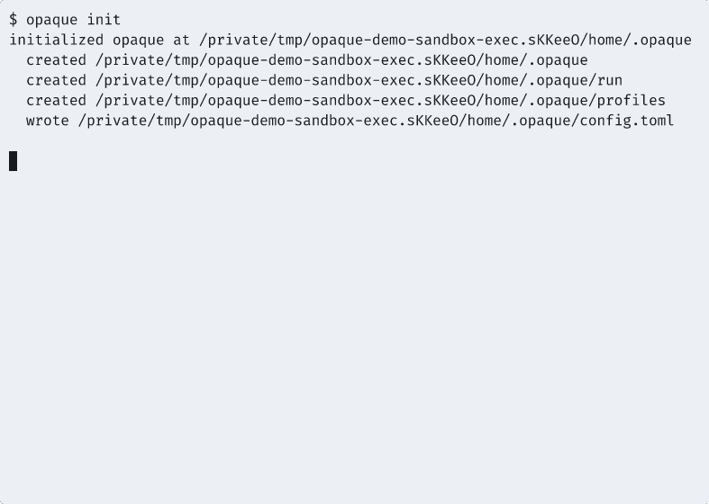

# Opaque

> Private dogfooding workspace: experiments, customer demo operations, app/repository
> configurations, and validation records live in `kcirtapfromspace/opaque-dogfood`.
> The public product upstream is `kcirtapfromspace/opaque`; its badges below describe
> that upstream, not the validation status of this private workspace.


[](LICENSE)


### Secrets stay ███████. Agents stay powerful.

### Approve the work. Keep authority bounded.

Opaque lets a team give an AI coding agent (Codex, Claude Code, etc) a
**bounded piece of work** — publish a secret, dispatch a release, run a
fixed host check, read scoped application data — approve exactly what it's
allowed to do, and inspect the evidence after. LLMs get **operations**,
never plaintext secret values.

## What It Does

Every operation passes through:

**Policy -> Approval -> Execute -> Sanitize -> Audit**

Multi-step work adds **plan -> review -> approve -> run -> inspect** — see
[bounded agent work](docs/bounded-work.md).

New here? The [15-minute tutorial](docs/tutorial.md) takes you from install to a
secret your agent moved but never saw, with an audit chain proving it.

## Features

- Deny-by-default policy engine with allowlist rules
- **Bounded agent work**: a pinned task manifest — publish a secret, dispatch a release, run a fixed SSH host check, read scoped data — approved once as a whole, each action charging exactly one slot, with a receipt (`opaque task plan|run|show|reconcile|revoke`, see `docs/bounded-work.md`)
- **Trust-domain enforcement**: run the daemon as a dedicated service account (or separate container) that exclusively owns every key, database, and config — startup verifies custody and fails closed, turning tamper-evidence into tamper-prevention (`docs/deployment.md`)
- **Signature-bound approvals**: pluggable factor registry — macOS Touch ID / Linux polkit, paired second device (Ed25519, decision-bound signatures), FIDO2 hardware keys and passkeys (challenge-bound, verified daemon-side), and a trusted-workstation full-manifest reviewer for tasks; the audit chain records *who* approved, cryptographically
- Identity substrate: daemon-owned OIDC login (PKCE), on-behalf-of delegation tokens, live-resolved roles, segregation of duties
- Tamper-evident HMAC audit chain (SQLite) with `opaque audit verify`, restart-safe sequencing, and correlation IDs
- Sandboxed execution: bubblewrap + Landlock + seccomp applied to every exec child; typestate-enforced response sanitization + secret-pattern scrubbing
- Client identity from Unix peer creds + executable identity (path/hash, optional macOS Team ID)
- **Federation**: one org signature carries policy to a whole fleet (`opqb1` bundles, verified before parsing, with anti-rollback and substitution refusal enforced from custody); the audit chain exports to SIEM over spool/webhook/TLS syslog carrying each record's sequence number and hash; daemons produce signed posture attestations and can be required to prove posture before receiving key material (`docs/federation.md`)
- MCP server for Claude Code integration
- Providers: GitHub secrets, GitLab CI variables, 1Password, Bitwarden Secrets Manager, HashiCorp Vault, AWS Secrets Manager
- Policy presets for common workflows; deploy templates for systemd, launchd, docker-compose, and Kubernetes (`deploy/`)

## Install

### macOS (Homebrew)

```sh
brew install kcirtapfromspace/tap/opaque
```

### Linux / macOS (shell script)

```sh
curl -sSfL https://raw.githubusercontent.com/kcirtapfromspace/opaque/main/install.sh | sh
```

### From Source

```sh
cargo install --git https://github.com/kcirtapfromspace/opaque.git opaque opaqued opaque-mcp
```

Binaries:

| Binary | Role |
|--------|------|
| `opaqued` | Trusted daemon (enclave, policy, approvals, audit) |
| `opaque` | CLI client |
| `opaque-mcp` | MCP server for Claude Code |

## Platform Support

| Platform | Architecture | Status |
|----------|-------------|--------|
| macOS | Apple Silicon (aarch64) | Fully supported |
| macOS | Intel (x86_64) | Fully supported |
| Linux | x86_64 | Fully supported |
| Linux | aarch64 | Fully supported |

## Quickstart: Claude Code (MCP)

1. Initialize with a preset:
   ```bash
   opaque init --preset github-secrets
   ```

2. Start the daemon:
   ```bash
   opaqued
   # Or install as a service: opaque service install
   ```

3. Add to your Claude Code MCP config:
   ```json
   {
     "mcpServers": {
       "opaque": {
         "command": "/path/to/opaque-mcp"
       }
     }
   }
   ```

4. Ask Claude Code to sync a secret:
   > "Set the GitHub Actions secret API_KEY for myorg/myrepo using my keychain"

Full MCP docs: [MCP integration](docs/mcp-integration.md)

## Quickstart: Codex / CLI

1. Initialize with a preset:
   ```bash
   opaque init --preset github-secrets
   ```

2. Start the daemon:
   ```bash
   opaqued
   ```

3. Test connectivity:
   ```bash
   opaque ping
   opaque execute test.noop
   ```

Optional: run your agent through Opaque wrapper mode (session-scoped):

```bash
opaque agent run -- codex
```

4. Sync a GitHub secret:
   ```bash
   opaque github set-secret \
     --repo myorg/myrepo \
     --secret-name API_KEY \
     --value-ref keychain:opaque/api-key
   ```

   Sync a GitLab CI variable:
   ```bash
   opaque gitlab set-ci-variable \
     --project mygroup/myproject \
     --key API_KEY \
     --value-ref keychain:opaque/api-key
   ```

5. Build a refs-only manifest from `.env.example` and publish through Opaque:
   ```bash
   opaque github build-manifest \
     --env-file .env.example \
     --value-ref-template 'bitwarden:production/{name}' \
     --out .opaque/env-manifest.json
   ```

   Manually edit `.opaque/env-manifest.json` if any refs need adjustment, then publish:
   ```bash
   opaque github publish-manifest \
     --repo myorg/myrepo \
     --manifest-file .opaque/env-manifest.json
   ```

6. Review the audit log:
   ```bash
   opaque audit tail --limit 10
   opaque audit tail --query github --limit 10
   ```

Full CLI docs: [Getting started](docs/getting-started.md)

## Policy Presets

Get started quickly with built-in presets:

```bash
opaque policy presets                        # list available presets
opaque init --preset safe-demo               # test.noop only (safe to experiment)
opaque init --preset github-secrets          # GitHub secret sync for agents
opaque init --preset gitlab-variables        # GitLab CI variable sync for agents
opaque init --preset sandbox-human           # sandbox exec for humans only
opaque init --preset agent-wrapper-github    # wrapped-agent GitHub sync with session enforcement
```

Or apply a preset to an existing config:

```bash
opaque policy preset github-secrets
```

## Demos

### Enclave Quickstart (Init, Policy, Daemon, Execute, Audit)


### Sandboxed Exec (Captured stdout/stderr)



## Docs

- [Try the portfolio demo](https://demo.opaque.info/) — explore synthetic application metrics and scoped analyst, engineer and support views.

- [Docs index](docs/README.md)
- [Tutorial: your first gated operation](docs/tutorial.md)
- [Getting started](docs/getting-started.md)
- [Bounded agent work](docs/bounded-work.md)
- [Identity](docs/identity.md)
- [MCP integration](docs/mcp-integration.md)
- [Bitwarden setup](docs/bitwarden.md)
- [Vault setup](docs/vault.md)
- [Federation](docs/federation.md)
- [Policy](docs/policy.md)
- [Operations](docs/operations.md)
- [LLM harness](docs/llm-harness.md)
- [Demos](docs/demos.md)
- [Deployment](docs/deployment.md)
- [Security assessment](docs/security-assessment.md)
- [Deferred roadmap](docs/roadmap-deferred.md)

## Deferred

See [Deferred roadmap](docs/roadmap-deferred.md). Notably:

- iOS second-device approvals / Face ID
- A general-purpose tenant operator and hardware attestation

## License

Business Source License 1.1 (BUSL-1.1). See [LICENSE](LICENSE).
