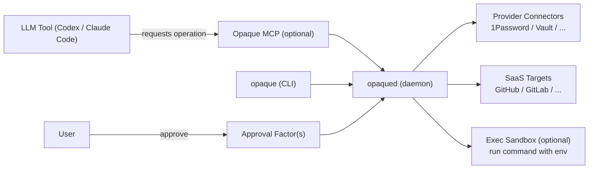
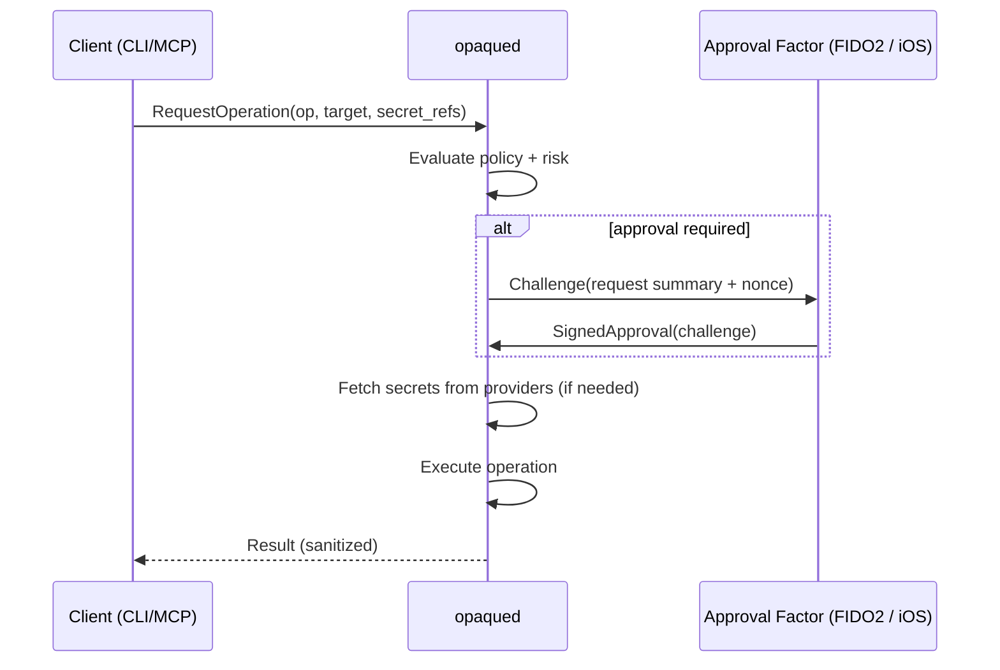

# Opaque Architecture

This document proposes an architecture for an approval-gated secrets broker that can be used alongside AI coding tools without disclosing plaintext secrets to the model.

## 1. Design Goals

- No plaintext secret disclosure to LLM context:
  - secrets must not be pasted into prompts
  - secrets must not be returned via tool output
  - secrets must not appear in logs
- Proof-of-life + explicit user approval before first use (and optionally per-use):
  - security key (FIDO2)
  - local OS biometrics (Touch ID on macOS; Linux varies)
  - second-device biometric approval (FaceID/TouchID on iOS)
- Pluggable secret sources:
  - 1Password
  - HashiCorp Vault
  - extendable to other providers
- Pluggable delivery targets:
  - "agent-safe" operations (broker performs the operation; model receives sanitized results)
  - environment/process execution (for human-driven workflows; higher risk if the model can run arbitrary commands)
  - SaaS secret stores (GitHub Actions secrets, GitHub Codespaces secrets, GitLab CI variables)
  - Kubernetes secrets (cluster-side) without exposing values to the client
  - cloud provider access (starting with AWS)
- Strong auditability: who approved what, when, and for which target.

## 2. Important Constraint (Reality Check)

If an LLM agent can run arbitrary commands on your machine and has unconstrained network egress, it can often exfiltrate anything it can read.

There are two distinct goals you called out:

1. Prevent **accidental disclosure** (secrets appearing in prompts/logs/tool output).
2. Resist a **malicious agent runtime** (actively trying to steal secrets).

To satisfy (1), it is usually sufficient that secret *values* never flow back through the LLM-visible channels.

To satisfy (2), you must also ensure the agent-controlled runtime never gets access to plaintext secrets *and* cannot trivially exfiltrate them by running arbitrary commands (or by asking the broker to perform “reveal” operations).

Therefore, "never disclose secrets to the LLM" requires **one** of:

1. Secrets never enter the agent-controlled process space (preferred):
   - the broker executes privileged operations itself (HTTP calls, SaaS updates, etc).
2. Agent-controlled processes run inside a sandbox with controls:
   - network egress allowlists
   - output redaction
   - explicit policy allowlists for which binaries can receive which secrets

Opaque is designed around (1) by default, and supports (2) as an opt-in compatibility mode.

### 2.1 What "Hard Guarantee" Can Mean Here

With careful API design, Opaque can offer a strong guarantee that:

- plaintext secrets are never returned to the client (CLI/MCP) and therefore never enter the LLM context
- plaintext secrets never enter the agent-controlled process space (in agent-safe operation mode)

However, it cannot guarantee that a malicious agent cannot exfiltrate *other* sensitive data it can access (source code, files, API responses) unless the agent runtime itself is sandboxed.

In practice, “hard guarantee” becomes:

- **Hard guarantee (secrets):** achievable by never providing "reveal secret" APIs and by executing secret-using operations inside the broker.
- **Hard guarantee (exfiltration):** requires sandboxing + network egress control for anything the agent can execute.

## 3. High-Level System

### Components

- `opaqued` (local daemon)
  - policy engine (who/what can request which secret use)
  - provider connectors (1Password, Vault, etc)
  - approval orchestration (proof-of-life, step-up auth)
  - audit log
  - operation executors:
    - GitHub Actions/Codespaces secret sync
    - GitLab CI variable sync
    - Kubernetes secret/manifest operations
    - AWS operations (signed proxy / SDK calls)
    - HTTP proxy operations (strict allowlist)
- `opaque` (CLI)
  - user-facing configuration, setup, debugging
  - “exec mode” wrapper (optional) to run a command with environment injected
  - starts/stops the daemon
- Approval factors
  - `fido2` (hardware security key / passkey)
  - `local-bio` (OS biometric prompt on the same machine)
  - `ios-approve` (second-device approval)
- Integrations
  - MCP server (optional): exposes *operations* to agent tools without returning secret values
  - GitHub/GitLab sync modules (push secrets to SaaS secret stores)

### Supported platforms (v1)

- macOS (LaunchAgent in GUI session — see `docs/deployment.md`)
- Linux (systemd user service in graphical session — see `docs/deployment.md`)

### Component diagram

## 4. Core Idea: "Secrets as Capabilities"

Opaque avoids returning plaintext values. Instead it grants **capabilities**:

- A capability is scoped to:
  - a specific operation (ex: "set GitHub Actions secret")
  - a specific target (repo/project/host)
  - a time window (TTL)
  - a calling identity (client)
- The broker uses secrets internally to perform the operation.
- The model receives results (status codes, resource IDs, sanitized payloads), not the secrets.

This resembles how `ssh-agent` avoids handing out private keys: clients ask the agent to sign, not to reveal the key.

## 5. Trust Boundaries

- **Trusted**:
  - `opaqued` process (local daemon)
  - the approval factor(s) and pairing keys
  - configured provider connectors and their credentials (stored in OS keychain)
- **Untrusted / semi-trusted**:
  - the LLM and its tool runtime
  - arbitrary commands the agent chooses to run
  - dependencies installed during runs

## 6. Identity and Policy

### Client identity (local)
Minimum viable identification:

- Unix socket peer creds: uid/gid/pid
- executable path + SHA-256

Stronger on macOS:

- verify code signature + Team ID (treat "unsigned" as high risk)

Policy rules should be expressible as:

- allow `client_id` to invoke `operation` for `secret_ref` against `target`, with constraints

Examples:

- Allow the MCP server process to call `github.set_actions_secret` only for repos under `org/acme-*`.
- Allow `opaque exec -- npm` to receive `NPM_TOKEN` but only when egress is limited to `registry.npmjs.org`.

## 7. Approval (Proof of Life)

Approval is required when:

- a secret is used for the first time for a (client, operation, target) tuple
- policy requires step-up for high-risk actions (ex: writing CI secrets)
- a previous approval lease expired

### Approval request contents (what the user sees)

Keep it explicit and non-technical:

- client: "Claude Code" (and executable hash)
- action: "Set GitHub Actions secret"
- target: `org/repo` and secret name (not value)
- TTL: "approve for 10 minutes" or "one-time"

### Native OS Popup Approvals (v1)

Opaque v1 uses **native OS authentication prompts** (not terminal prompts) to ensure proof-of-life:

- macOS:
  - `LocalAuthentication` prompt using `LAPolicyDeviceOwnerAuthentication`
  - Shows a system-owned Touch ID / password dialog
  - Requires a GUI (Aqua) session — daemon must run as a LaunchAgent, never a LaunchDaemon
- Linux (two-step flow):
  - **Step 1: Intent dialog** — `zenity --question` or `kdialog --yesno` shows operation details before authentication
  - **Step 2: Polkit authentication** — `CheckAuthorization` with `AllowUserInteraction` for system auth
  - This separation ensures the user always sees what they are approving, regardless of whether the polkit agent displays operation details
  - Requires a graphical session, a polkit auth agent, and `zenity` or `kdialog`
  - Supported desktops: GNOME, KDE Plasma, MATE, XFCE, Cinnamon, Budgie, LXQt (see `docs/deployment.md` for full tier list)
- iOS (second device, deferred to v3):
  - QR pairing + Face ID gated approvals via a companion app (see `docs/mobile-approvals.md`)

If the daemon is running without access to an interactive user session (headless / no auth agent / no display server), approvals **fail closed**. The daemon refuses to start. See `docs/deployment.md` for session detection requirements.

### Approval sequence

### iOS second-device factor (sketch)

- Pairing:
  - daemon displays QR containing pairing public key + endpoint
  - iOS app scans, establishes an encrypted channel, stores daemon identity
- Approvals:
  - daemon sends approval challenge (push notification or local-network delivery)
  - user approves with FaceID/TouchID
  - app signs challenge with Secure Enclave key, returns signature

## 8. Provider Connectors

Connectors are responsible for:

- authentication to provider
- reading secrets by reference
- caching with TTL/lease semantics when supported (Vault)
- returning secret material only inside `opaqued` memory

Recommended patterns:

- 1Password:
  - prefer service-account / Connect API where possible
  - store provider auth tokens in OS keychain
- Vault:
  - prefer OIDC or AppRole with short-lived tokens
  - prefer dynamic secrets (DB creds, cloud creds) to reduce blast radius

## 9. Delivery Targets

### 9.1 Agent-safe operations (preferred)

Examples:

- `github.set_actions_secret(repo, name, value_ref)`
- `github.set_codespaces_secret(repo_or_user, name, value_ref)`
- `gitlab.set_ci_variable(project, key, value_ref)`
- `http.request_with_auth(secret_ref, request)` (strict allowlist of domains/methods)
- `k8s.set_secret(namespace, name, items_from_refs)`
- `aws.call(service, action, params)` (broker executes AWS SDK call; response is sanitized)

In this mode the secret never enters the agent’s process.

### 9.2 Exec mode (compatibility)

`opaque exec --profile myproj -- <command>`

- broker injects env vars into a subprocess
- optionally runs it inside a sandbox:
  - egress allowlist
  - filesystem restrictions
  - output redaction (best-effort)

This is useful for humans running dev tools, but is not a complete guarantee if the agent can pick arbitrary commands.

### 9.3 .env brokering

Avoid emitting plaintext `.env` to stdout when the caller is an LLM tool.

Safer alternatives:

- "render to FD": pass an anonymous file descriptor to a trusted child process
- "render to temp file": create a temp file with `0600`, delete on exit (human use)
- "exec": don’t render a file at all; set env in the target process

### 9.4 Kubernetes

Goal: allow the agent to cause Kubernetes changes that require secret material (imagePullSecrets, API tokens for a workload, etc) without ever seeing the secret value.

Recommended model:

- Opaque stores cluster access (kubeconfig / exec auth) and performs Kubernetes API calls itself.
- For secret writes, use a Kubernetes identity (service account / user) that can `create/patch/update` secrets but is not granted `get/list/watch` secrets, so the value cannot be read back via the same identity.

Operations:

- `k8s.set_secret(namespace, name, items_from_refs)`
- `k8s.patch_secret(namespace, name, items_from_refs)`
- `k8s.apply_manifest(manifest)` with a policy that rejects `kind: Secret` (force secrets through `set_secret` so values only come from refs, never from LLM-provided YAML)

### 9.5 AWS (Cloud Provider Access)

Avoid long-lived access keys when possible. Preferred sources:

- Vault AWS secrets engine (dynamic STS creds)
- AWS SSO / OIDC / device-code flows (broker-managed session)
- static IAM access keys only as a last resort

Two delivery patterns:

1. **AWS SDK proxy (preferred):** client requests an AWS operation, broker performs the signed call and returns sanitized output.
   - Pros: no keys ever leave the broker
   - Cons: you must model/allowlist which AWS APIs the agent can call
2. **Exec mode with sandbox:** broker injects short-lived STS creds into a sandboxed command (awscli/terraform/kubectl-eks).
   - Pros: supports existing tools
   - Cons: without strong sandboxing + egress allowlists, a malicious agent can steal the creds

Pragmatic v1 approach:

- Implement AWS SDK proxy for a small set of allowed operations (ECR/EKS/S3/STS).
- Add exec-mode STS injection for humans, and require step-up auth + strong egress restrictions for agent use.

## 10. Operation Safety Model (Preventing Secret "Reveal" Paths)

To support both accidental and malicious-agent threat models, operations should be classified and filtered:

- `SAFE`: does not use secrets, or uses secrets but cannot return them (ex: set GitHub secret)
- `SENSITIVE_OUTPUT`: may return credentials or token-like outputs (ex: ECR login password). These should be disabled for LLM clients by default.
- `REVEAL`: explicitly returns secret values. These should not be exposed to MCP/agent clients at all (human-only UI, if implemented).

Additionally:

- Never allow a generic "get secret value" tool call from an LLM-facing client.
- Avoid returning raw HTTP response bodies from authenticated proxy calls unless the endpoint is allowlisted and the response is scrubbed.

## 11. Audit and Observability

Audit events (append-only):

- approval requested
- approval granted/denied + factor used
- operation executed + target + status
- provider fetches (metadata only; never values)

Store locally (SQLite) with optional export to JSON for enterprise setups.

## 12. Minimal MVP Plan

### MVP 0 (days)

- CLI only (no daemon):
  - `opaque exec` pulls secrets from 1Password/Vault and runs a command
  - manual approval prompt in terminal
  - never prints secret values

### MVP 1 (1-2 weeks) - v1 Targets

- `opaqued` daemon + policy + audit log
- approval factor: FIDO2 security key (local)
- GitHub Actions secret sync module
- GitLab CI variable sync module
- GitHub Codespaces secret sync module
- Kubernetes `set_secret` (from refs only)

### MVP 2 (2-4 weeks)

- iOS second-device approvals (pairing + signed challenges)
- MCP server exposing safe operations
- AWS SDK proxy (initial allowlist)

### MVP 3 (future)

- hardened exec sandbox:
  - Linux: namespaces + seccomp + egress allowlist
  - macOS: likely VM/container-based runner for per-command egress policy
- broader cloud providers (GCP/Azure)

## 13. Decisions (Based on Your Answers)

1. Platforms: macOS + Linux (no Windows).
2. GitHub/GitLab auth: support both user tokens (PAT) and app-style integrations (least privilege).
3. GitHub scopes: support repo secrets and environment secrets (v1).
4. SaaS targets (v1): GitHub Actions secrets, GitHub Codespaces secrets, GitLab CI variables.
5. Kubernetes: support EKS and self-managed clusters (v1); write-only secrets RBAC is acceptable.
6. AWS auth sources: support Vault dynamic creds, AWS SSO, and static keys (last resort).

## 14. Remaining Open Questions

1. Approval UX for v1: CLI prompt only, or do you want a small local GUI/menubar app that shows approvals (with CLI fallback)?
2. For GitHub App: do you want org-wide install support (multi-repo) in v1, or single-repo to start?
3. For GitLab “app-style”: GitLab OAuth application vs project access token; which do you prefer to prioritize?
