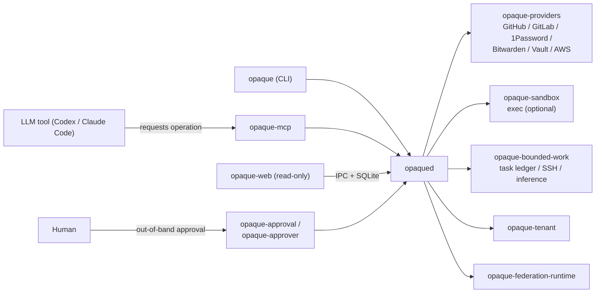

# Architecture

Opaque lets a team give an agent a bounded piece of work, keep control while
it runs, and inspect the evidence after. Every capability (secrets,
identity, policy, certificates, receipts) serves one progression:

**Policy → Approval → Execute → Sanitize → Audit**, and for multi-step work,
**plan → review → approve → run → inspect** (see [bounded work](bounded-work.md)).

LLMs get **operations**, never plaintext secret values. Nothing a local
client process claims about itself is trusted, since an agent can drive the
same `opaque` CLI a human does.

## 1. Design goals

- No plaintext secret disclosure to LLM context: not in prompts, tool
  output, or logs.
- Presence, not classification: authority comes from an out-of-band approval
  act, not from guessing whether a process is "the human" or "the agent."
- Custody, not just correctness: once [trust-domain enforcement](deployment.md)
  is on, the daemon's keys, database, and config belong to an identity the
  agent's uid cannot touch.
- Tamper-evidence over the whole record: every audit event HMAC-chains;
  federated fleets export that chain to a SIEM in independently verifiable form.
- Bounded, inspectable work: a multi-step task is a pinned manifest approved
  once, each action charging one slot, with a receipt. It is not an
  open-ended credential handed to the agent.

## 2. Threat model

An agent with arbitrary commands and unconstrained egress can exfiltrate
anything it can read. Opaque doesn't claim otherwise. What it does claim:

1. **Brokered credentials stay in custody.** Operations use provider secrets
   inside the broker and return their permitted result. Typestate in
   `opaque-core` requires sanitization before returning operation responses;
   it does not prove every possible output is harmless. MCP v2 additionally
   constrains any disclosed projection to its signed result policy.
2. **A malicious agent runtime is resisted, not just an honest one.** The
   daemon executes secret-using operations itself. Client classification
   can narrow policy, but cannot establish human identity: an agent can drive
   the same executable a human's terminal does. Trusted identity, current
   policy and the operation's required review remain necessary. Sandboxed exec (Landlock/seccomp on Linux, Seatbelt on macOS)
   bounds an agent-driven command when exec mode is used at all.
3. **A compromised daemon-uid process is bounded by trust-domain
   separation**, not by this codebase alone. See [deployment](deployment.md).

## 3. Crates

`opaqued`'s original ~65k-line monolith is now a ~23k-line composition root
over focused crates. Each crate owns one concern; `opaqued` wires them
together and runs the RPC dispatch loop.

| Crate | Owns |
|---|---|
| `opaque-core` | Shared types: policy engine, operation/audit/proto, task manifests, tenant bindings, sealing, socket hygiene, portable evidence contracts |
| `opaqued` | Composition root: enclave, RPC dispatch, identity store, provisioning API, agent sessions |
| `opaque-providers` | GitHub, GitLab, 1Password, Bitwarden, Vault, AWS. GCP/Azure/Doppler/Infisical are Cargo features `opaqued` enables by default, so all ten still ship in the daemon binary today |
| `opaque-approval` | Device pairing, FIDO2, factor registry, native prompting, approval-server relay |
| `opaque-native-approval` | Native review/auth shared by the daemon and the workstation approver |
| `opaque-approve-helper` | Native full-review helper on macOS/Linux, plus Linux polkit approval |
| `opaque-approver` | Trusted paired-workstation full-manifest approver, CLI and macOS reference-notice app on a separate trusted workstation ([setup](remote-approvals.md)) |
| `opaque-sandbox` | Landlock/seccomp/Seatbelt isolation, execve hooks, composite secret-resolver dispatch |
| `opaque-bounded-work` | The [task](bounded-work.md) and signed MCP invocation ledgers, SSH certificate execution, inference brokering |
| `opaque-tenant` | Tenant custody boundary, delegated IdP provisioning types |
| `opaque-federation-runtime` | [Federation](federation.md): signed policy bundles, SIEM export, posture attestation |
| `opaque-mcp` | MCP server for Claude Code and other MCP clients |
| `opaque-web` | Read-only local dashboard |
| `opaque` | CLI client and offline `opaque-evidence` verifier/producer |
| `opaque-showcase` | Demo/sales collateral (chat + metrics gateway). Excluded from default runtime builds; reused as a daemon test fixture through a dev dependency |


```mermaid
flowchart LR
  Agent["LLM tool (Codex / Claude Code)"] -->|requests operation| MCP["opaque-mcp"]
  CLI["opaque (CLI)"] --> D
  MCP --> D["opaqued"]
  Web["opaque-web (read-only)"] -->|IPC + SQLite| D
  Human["Human"] -->|out-of-band approval| Approval["opaque-approval /<br/>opaque-approver"]
  Approval --> D

  D --> Providers["opaque-providers<br/>GitHub / GitLab / 1Password /<br/>Bitwarden / Vault / AWS"]
  D --> Sandbox["opaque-sandbox<br/>exec (optional)"]
  D --> BoundedWork["opaque-bounded-work<br/>task ledger / SSH / inference"]
  D --> Tenant["opaque-tenant"]
  D --> Federation["opaque-federation-runtime"]
```

## 4. Trust boundaries

- **Trusted:** `opaqued`, the approval factor(s) and pairing/workstation
  keys, configured provider credentials, the audit chain's HMAC key.
- **Key custody determines audit integrity:** by default the daemon's DB,
  key and config live at the agent's own uid. An attacker who obtains the
  HMAC key can forge history that passes local verification. A dedicated
  service account or separate container denies the agent access to custody;
  the daemon and its administrators remain trusted. A retained external
  checkpoint/high-water mark is needed to detect an older intact snapshot.
  See [deployment](deployment.md) and [evidence](evidence-checkpoints.md).
- **Untrusted:** the LLM and its tool runtime, arbitrary agent-run commands,
  dependencies pulled in at run time.

## 5. Identity and policy

Client identity is derived, never self-declared: Unix socket peer
credentials (uid/gid/pid) plus executable path and SHA-256. (macOS Team-ID
matching exists in policy but nothing populates it from a real code-signature
check yet; treat it as inert.) Client type filters and safety classes can
restrict policy matches. They do not prove a human is present: an agent can
also drive the CLI, so classification cannot replace trusted identity or approval.

Real authority comes from [identity](identity.md): a verified human (OIDC
login, daemon-owned), an agent workload, or a config-declared service
principal, with roles resolved live at request time, never embedded in a
token, so revocation is immediate. Delegated access is the intersection of
what the agent session and the delegating human may do.

Policy rules match `client_id` × `operation` × `target`:

```toml
[[rules]]
name = "mcp-github-only"
client_id = "opaque-mcp"
operation_pattern = "github.*"
target_pattern = "org/acme-*"
allow = true
```

See [policy](policy.md) for the full rule and preset reference.

## 6. Approval

Approval is required on first use of a (client, operation, target) tuple, on
policy-flagged high-risk actions, and after lease expiry. The factor
registry is pluggable and challenge-bound:

- **Local biometric**: macOS Touch ID; Linux polkit with a pre-auth intent
  dialog (`zenity`/`kdialog`) shown before the OS prompt.
- **Paired second device**: Ed25519, decision-bound signatures.
- **FIDO2**: hardware keys and passkeys, verified daemon-side.
- **Paired workstation**: a separate machine reviews the entire task
  manifest and signs a decision; see [bounded work](bounded-work.md) and
  `crates/opaque-approver/README.md`.

No interactive session or configured factor reachable (headless, no
display, no paired device) fails closed, never an unapproved fallback. See
[deployment](deployment.md) for platform session-detection requirements.

## 7. Sandboxed execution

`opaque exec` is the compatibility path for humans running existing dev
tools with secrets injected as env vars. It is not a hard guarantee if the agent
picks the command. `opaque-sandbox` applies Landlock + seccomp (Linux) or
Seatbelt (macOS) to every exec child; typestate sanitization and
secret-pattern scrubbing apply regardless of sandbox mode.

Agent-safe operations are preferred over exec: the daemon performs the
privileged call itself (`github.set_actions_secret`, `task_run`, …) and
returns a sanitized result, so the secret never enters the agent's process.

## 8. Bounded agent work

Beyond a single operation, Opaque hands the agent a **task**: an immutable
manifest approved once as a whole, each action charging one slot exactly
once. Three operation families today: repository/release work,
application-evidence reads, host operations over signed SSH certs. See
[bounded work](bounded-work.md) for the manifest, CLI, lifecycle, and what's
implemented versus fixture-validated.

## 9. Federation

One org signature carries policy to a fleet (`opqb1` bundles, verified
before parsing, anti-rollback from custody). Each daemon exports its audit
chain to a SIEM in independently verifiable form, and can produce signed
posture attestations and require verified posture before releasing key
material. See [federation](federation.md).

## 10. Audit

Audit rows record approval decisions, observed execution outcomes and provider
metadata without secret values. HMAC chaining and an authenticated retained head
let `opaque audit verify` detect row/head tampering when the attacker lacks the
key. Startup refuses invalid or unsupported legacy state. Retention removes a
verified expired insertion-order prefix; it is not arbitrary row deletion.

SIEM exports carry sequence numbers and record hashes. Portable producer-signed
checkpoints additionally bind exact export bytes, enrollment and sequence range
for verification without the broker HMAC key. Historical completeness, freshness
and provider effects require additional evidence; an older intact snapshot can
pass local checks. See [evidence checkpoints](evidence-checkpoints.md) for trust
pins, retention receipts and the mandatory older-store upgrade procedure.

## 11. Providers

GitHub Actions/Codespaces secrets, GitLab CI variables, 1Password, Bitwarden
Secrets Manager, HashiCorp Vault, AWS Secrets Manager. GCP, Azure, Doppler,
and Infisical are feature-gated in `opaque-providers`, but `opaqued` enables
all four anyway, so today's shipped binary compiles in all ten regardless.

## 12. Platforms

| Platform | Architecture | Status |
|---|---|---|
| macOS | Apple Silicon (aarch64), Intel (x86_64) | Fully supported |
| Linux | x86_64, aarch64 | Fully supported |

These are the baseline distribution targets, not evidence that every new
capability has been qualified on each target. The new reviewer app is macOS-only;
source bundle checks do not establish signed/notarized installation, URL routing,
accessibility or Intel qualification. See [reviewer setup](remote-approvals.md).

Session-mode macOS uses a LaunchAgent and Linux a graphical systemd user service
with a polkit auth agent. A split daemon uses a system service with out-of-band
approval factors instead. See [deployment](deployment.md).

## Deferred

iOS second-device approvals (FaceID) and a general-purpose interactive
tenant runtime remain out of scope for now. See the
[deferred roadmap](roadmap-deferred.md).
