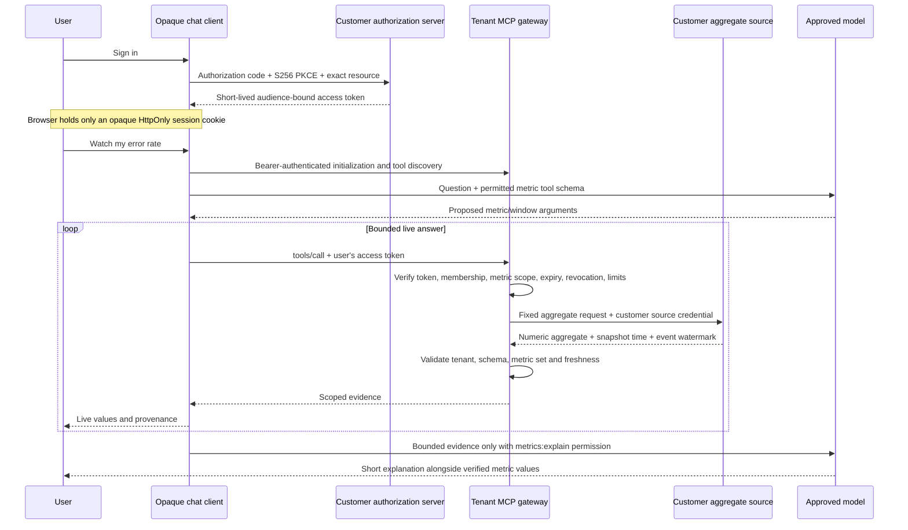

# Customer-scoped streaming metrics chat

> **Historical evidence — September 4, 2026.** Use the
> [private milestone roadmap](roadmap.md) for current work. This note preserves
> the original gateway contract and evidence; later organization, portfolio and
> hosted-demo validation extend it. A real source, production IdP and unified
> broker/gateway admission and revocation remain M3. Existing OAuth support does
> not complete the historical attestor PRD's EMA provisioning checklist.

The user asks a chat agent a question about live metrics. The agent may choose a permitted tool, but cannot select a customer, supply a source credential, change a query, or authorize itself. The gateway derives the customer and metric permissions from a validated OAuth access token. A separate customer-specific credential authenticates the gateway to that customer's aggregate source.

This increment adds `opaque-metrics`, an experimental standalone gateway and chat client. It does not silently widen the existing `opaqued` task API or share the previous fixture's grants. The initial integration uses two synthetic customer event streams, with an actual language model available through the existing cluster's llama.cpp service. It is intended to validate this data-access workflow before connecting private data or reconciling a Kubernetes deployment.

## Flow

## Implemented contract

Each gateway is configured for one tenant, one exact MCP resource audience, an explicit issuer/subject admission list, and one source mapping. The token validator pins a configured RSA public key and accepts RS256 `at+jwt` access tokens. It rejects ID tokens, arbitrary header-selected keys, wrong issuers/audiences/tenants/subjects, expanded scopes and expired grants. Static key rotation requires trusted configuration replacement. Tokens are checked on each HTTP MCP request; long-running chat work also checks the current grant before each source request, evidence release and model disclosure.

The HTTP MCP endpoint supports stateless Streamable HTTP with JSON responses, authenticated initialization, tool discovery and tool calls. It publishes protected resource metadata and authorization challenges. The chat client uses this HTTP path rather than a direct data-provider shortcut. A preregistered browser client uses authorization code/S256 PKCE, a browser-bound single-use state, exact redirect/resource binding, and server-side token storage. Provider credentials never leave the gateway's source client and are not passed through from the user token. [MCP authorization](https://modelcontextprotocol.io/specification/2025-11-25/basic/authorization), [MCP transport](https://modelcontextprotocol.io/specification/2025-11-25/basic/transports), [JWT access-token profile](https://www.rfc-editor.org/rfc/rfc9068.html).

The initial tool is `opaque_metrics_query`. Its only arguments are selected metric names and a 1–300 second rolling window. Available metrics are request rate, error percentage, p95 latency and active sessions. Per-metric scopes are required in addition to `metrics:read`. The source URL, customer, credential, raw records, SQL and output destinations are not tool arguments. A response contains only permitted numeric aggregates and bounded provenance. Foreign tenant results, stale watermarks, excessive responses, redirects and malformed evidence fail closed without automatic retry.

`metrics:stream` permits the chat client to repeat reads for at most 30 seconds. `metrics:explain` separately permits sending the user's question and authorized aggregate evidence to the configured model. Neither scope expands permitted metrics. A grant has at most one active chat, the gateway has bounded concurrency, and each grant is rate-limited. The UI distinguishes data event time, source snapshot time and gateway receipt time, and renders all model/tool text as text. Stopping the display cancels future work; already sent requests may still finish upstream.

Monitoring cadence is owned by the runtime: a watch/live/stream/monitor request defaults to ten seconds, explicit supported durations must be 1–30 seconds, and a snapshot does not become a stream because the model proposes one. The server checks streaming permission against the final duration. Explicit requests for known forbidden metrics receive a clear scope denial before model or source access; the MCP resource still independently validates every metric permission.

A local logout revokes the current access-token ID and persists the denylist before acknowledging success. Browser sessions disappear on restart; revoked access tokens remain rejected. The append-only local audit records tenant/subject, operation, outcome and evidence hash without raw questions, responses, source credentials or bearer tokens. This file is not an independently signed or tamper-proof audit ledger.

## Validation and deployment limits

The executable fixture and its current evidence are documented in the metrics chat runbook at `examples/metrics-chat/README.md`. Deterministic agent tests are explicitly labeled as such; a live model result must be separately observed and cannot be inferred from a provider stub passing.

The final native build passed 34 gateway/auth/provider/model Rust tests, 17 UI tests across the new and existing dashboards, Clippy with warnings denied, formatting and whitespace checks. The earlier full workspace run passed 1,685 tests with three existing ignored tests; the final chat-intent refinement was followed by focused tests and another complete two-customer protocol fixture. That fixture passed 24 recorded negative cases plus strict-schema checks, changing streams, and revocation during an active stream.

Live browser verification used the configured Gemma GPU service and fresh OAuth sign-in for each customer. Customer A's “Watch my error rate live” returned five changing snapshots through five authenticated MCP queries and the model explanation “The error rate is 7.74 percent.” Customer B's p95 question displayed a clear permission denial without increasing its source query count; its allowed request-rate question then returned its own source evidence and a 17.70 req/s explanation. The model omitted the requested time context from both short explanations, so the UI's validated window, event watermark and source time remain essential. Desktop (1280 pixels) and mobile (390 pixels) rendered without horizontal overflow or post-login console errors. Evidence is retained in `/private/tmp/omf-p7ciwxzj/browser-evidence.json` and `output/playwright/metrics-chat/`.

The first fixture runs separate native gateway/source processes on a shared host, with a distinct source secret and dataset per customer. It demonstrates authorization and data-routing behavior, not OS custody isolation against another same-user process or host administrator. Its disposable authorization server uses a known test RSA key and synthetic accounts; local HTTP exceptions are fixture-only. A real customer deployment needs its production authorization server and key lifecycle, HTTPS ingress, independently protected credential/state custody, and a source whose own authorization enforces the customer boundary.

The gateway uses a configured admission policy and local token-ID revocation, not an identity-provider back-channel revocation feed. Aligning its admission and revocation state with the existing broker is required before representing the two components as a single production control plane. The metric source is an aggregate API adapter; no warehouse, Kafka, Flink, database or customer event system has yet been connected.

The model's prose is an explanation, not authoritative metric evidence. It may omit context or make errors; the UI retains the validated values, units, window and watermark. Neither a model response nor this native-process fixture establishes confidential computing, model-weight attestation or tenant-isolated GPU memory.

## Next validation priorities

1. Connect one real application's operational aggregate source and its production identity provider. Validate membership removal, per-metric permissions, credential rotation and stale-stream behavior with two actual test tenants before expanding data access.
2. Reconcile gateway admission and revocation with Opaque's existing broker, then deploy the same contract with independently protected tenant credentials and explicit network boundaries on the cluster. Demonstrate cross-tenant denial at the source as well as the MCP gateway.
3. Add warehouse/lake queries only through bounded, tenant-authorized aggregate adapters. Validate query cost, streaming event-time semantics and answer grounding before considering an operator that manages these proven components.
