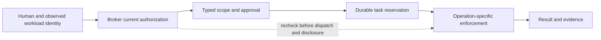

# Opaque: one product for bounded agent work

**Product and architecture decision · September 5, 2026 · private workspace**

This is the current direction for the work the operator requested: unify the
product, implement the next usable slice and refresh the customer demo. It
supersedes the September 4 memo's sequencing where they differ. Historical
validation remains in its dated records; this document does not turn a proposed
capability into a deployed one. The [roadmap](roadmap.md) tracks completion and
the [implementation PRD](prd-unified-bounded-work.md) defines this
slice. Keep all three private and out of generated public assets.

## The product decision

**Opaque lets a team give an agent a bounded piece of work, keep control while
it runs, and inspect the evidence afterward.**

The customer should understand one progression: **request → review limits →
authorize → execute → inspect the result**. Human identity, workload identity,
policy, secrets, certificates and receipts support this progression. They are
not separate products that the user must assemble.

The product's primary object remains a **task**. Its authority is an exact,
approved **grant** when the broker task path is used. The next demo slice adds a
persisted, visitor-approved one-read task to make the progression tangible. Its
separate demo coordinator must not be presented as a signed broker grant or
production federation. Unify the visible contract while keeping the enforcement
and evidence of each deployment explicit.

The first buyer remains a platform or engineering lead whose team already uses
agents and withholds sensitive access or supervises each action. Security owns
policy and custody requirements; developers and resource owners use the product
to finish work. This is a buyer hypothesis, not evidence of customer demand.

Keep the established brand line, “Secrets stay ███████. Agents stay powerful.”
Use **“Approve the work. Keep authority bounded.”** to explain the workflow.
Public copy should show a concrete useful action before describing cryptography.

## One architecture, three operation families

The unifying model is **who is acting, for whom, on what, within which limits,
under whose current authority, with what observed result**. The fields have
different enforcement points. No single certificate or identity token answers
all of them.

This is the target broker task flow. The public demo's new task coordinator
uses its own visitor approval and durable reservation with synthetic application
data; it does not acquire the broker's signed-approval or production-identity
properties merely by displaying the same progression.

| Operation family | Useful work | Enforcement contract | Role in the product |
| --- | --- | --- | --- |
| Application evidence | Read named, tenant-scoped aggregates and disclose permitted evidence to an approved model | Exact issuer/resource/client/tenant, current broker roles, source authorization, typed query, freshness and disclosure checks | Immediate public learning experience; next production connection target |
| Repository and release work | Publish an exact secret manifest or dispatch one reviewed staging artifact smoke check | Pinned source/destination contract, trusted approval, atomic slots, unknowns remain consumed, provider reconciliation | Existing durable-task path and first external-effect pilot |
| Host operations | Read one fixed service-health endpoint on one selected host | Broker grant plus Vault-signed SSH credential, exact host/principal/source, host command guard, session deadline, durable consumption and signed host response | Second adapter proving the same bounded-work model across a different transport |

Do not broaden SSH to an interactive shell to make the demo look more general.
Do not force a raw financial-data source into operational metrics with different
units or freshness semantics. A new operation requires a typed contract and
source-side enforcement, not a renamed example.

## Authority has one owner; credentials have specialized custodians

1. **The identity provider authenticates people.** Broker enrollment maps exact
   issuer and subject to explicit tenant membership and roles. Login alone does
   not create data access. A resource server accepts the specified access-token
   profile; an OIDC ID token cannot substitute for it.
2. **The attestor reports observed workload identity.** Today the listener-bound
   peer-credential path records UID and available executable evidence. Same-UID
   evidence is weaker than a separate-UID deployment. Caller labels never create
   principal identity or stronger assurance.
3. **The broker owns current authorization.** Production gateway checks use the
   same identity runtime as broker delegation through a narrow authenticated
   endpoint. Membership, disabled state, roles, token revocation and expiry are
   rechecked at source and disclosure boundaries. An unavailable authority denies
   further work. No independent gateway permission database may drift into an
   alternative authority source.
4. **The task ledger owns consumption.** Approval binds a canonical operation
   manifest. Atomic reservation precedes dispatch. A retry, process restart or
   delegate does not replenish it. Ambiguous dispatched effects remain unknown
   and consumed; a signed `max_uses` field alone cannot enforce a count.
5. **Each executor owns its last enforcement boundary.** The data source enforces
   actual tenant custody; the host enforces its command and session; the release
   destination enforces its workflow protections. Broker checks cannot retract
   data or external effects already received.
6. **Custody providers hold their own secrets and signing keys.** Keep Vault as
   the implemented SSH signer. Opaque owns ephemeral client keys, task approval
   and a separate host-control signing key; Vault retains the CA key. AWX has no
   role in this design. Add another signer only for a selected deployment with a
   demonstrated requirement and the same certificate-verification contract.

The “asymmetric interaction” is concrete: a worker can request and exercise
exact delegated work without obtaining the resource owner's broad credential or
the authority to widen the grant. Public-key proof identifies a holder or
verifies an issuer. Online authorization and durable state still decide whether
that holder may perform this particular action now.

## Choose standards at the boundary that needs them

Adopt established mechanisms where they solve the selected deployment's problem.
Do not begin a universal Opaque identity or capability-token protocol.

| Mechanism | Decision | Reason and limit |
| --- | --- | --- |
| OIDC, existing OAuth resource profile and SSH certificates | Use the current implementations; finish real provisioning | Authentication and transport credentials already have a role. Their presence does not prove approval, single use or effects. |
| OAuth rich authorization requests | Preserve a mapping from typed operation details; implement when a chosen authorization server needs it | RFC 9396 carries structured authorization details. Operation semantics and safe narrowing remain application-defined. [RFC 9396](https://www.rfc-editor.org/rfc/rfc9396.html) |
| DPoP | Defer to a named HTTP token-holder threat and compatible client/issuer | RFC 9449 binds an access token to a key and HTTP proofs. It is not arbitrary request-body approval or a consumption ledger. SSH already proves possession of its client key. [RFC 9449](https://www.rfc-editor.org/rfc/rfc9449.html) |
| SPIFFE/SPIRE | Preserve the attestor seam; add an adapter for a real workload deployment | SPIRE performs node/workload attestation and issues workload identities. The chosen evidence and trust domain determine assurance; identity issuance is not transaction authorization. [SPIRE](https://spiffe.io/docs/latest/spire-about/) |
| AuthZEN Authorization API 1.0 | Consider an interoperability adapter after the current broker endpoint has a real second consumer | The final specification provides an authorization-decision API. It does not replace Opaque's task ledger, approval ceremony or host enforcement. [Authorization API 1.0](https://openid.net/specs/authorization-api-1_0-final.html) |
| Offline attenuating capabilities and newer delegation drafts | Track; no new token encoding in this release | Offline verification does not establish current revocation or globally single-use authority. Introduce a format only after a relying party and coordination contract are known. |
| Hardware attestation and conditional key release | Separate deployment track | Software identity, container cleanup and ordinary GPU inference do not establish a measured confidential runtime. A hardware claim needs the actual runtime, verifier policy and evidence. |

## The demo becomes a view of work and its limits

Keep the existing fictional credit-union portfolio and available model choices.
It gives visitors a useful, repeatable question and already has live synthetic
source computation, role boundaries and a managed ten-minute lifecycle. Preserve
those working paths and update their framing.

The workspace should let a visitor answer these questions without opening raw
JSON:

- **Who am I and whose data can I use?** Show the current demo identity and
  assigned fictional customer. Make temporary demo identities explicit.
- **What work is allowed?** Show aggregate-only access, permitted query/tool,
  current purpose where enforced, question/session limits, expiry and the
  distinction between read and model disclosure.
- **What just happened?** Show an allowed, denied, unavailable or interrupted
  outcome with the evidence available for that operation. Show measure, window,
  source time and tenant checks beside the answer.
- **What can still happen?** Show existing remaining session allowance and the
  support-case deadline when applicable. A model change, browser refresh or new
  request label must not imply more permission.
- **How can I verify a boundary?** Offer a permitted aggregate question and a
  clearly outside-scope request. Report no source access only when actual
  dispatch instrumentation supports it. Do not infer it from a model refusal.

Add one concrete **Read service evidence** task alongside the existing chat. Its
fixed action reads `manual_review_rate_percent` over a 60-second window for the
assigned fictional customer, under the analyst identity only. The visitor
reviews the exact server-issued manifest and
approves one read with at most a five-minute task deadline, capped by current token
and workspace authority. The demo coordinator persists the task in SQLite,
reserves before source dispatch, denies a second execution and supports revoke.
Successful evidence is disclosed only after a current-authority recheck. An
ambiguous dispatched read never replenishes the allowance.

Show **Review → Approve one read → Run → Receipt**, with the exact customer,
metric, window, expiry and allowance visible before approval. A compact **Work
scope** projection may summarize server state, but is never an input that grants
permission. The receipt must identify its issuer as the demo coordinator and its
source as synthetic. Approval is the current visitor's action under a disposable
demo identity; it is neither the native paired-workstation ceremony nor a
cryptographically signed broker grant. Model prose cannot certify an effect.

Keep the task protocol fixture-only. Its one-read allowance is separate from
the existing chat question limit. Production startup or requests must not
silently switch from broker-owned authority to this demo coordinator. The
existing interactive chat, role controls and lifecycle remain usable; this
bounded operation is a focused demonstration, not a replacement query language.

The public SSH explanation may describe the bounded pattern as a separately
validated example. It must state that the visitor has not connected to a real
host. Internal hostnames, addresses, paths, test logs and deployment records stay
private. A graphical animation is illustrative, not execution evidence.

## Implementation sequence and gates

| Slice | Deliverable | Evidence to close it |
| --- | --- | --- |
| **Now: unify the visible product** | This strategy and PRD; persisted one-read synthetic demo task with review, visitor approval, atomic consumption and receipt; refreshed entry/workspace and visitor documentation | Relevant Rust/Python checks, concurrent/replay/restart/expiry/revocation tests, browser flow, actual source effects, generated-public-output inspection and deployment verification |
| **Next: finish one real connection** | One semantically correct aggregate adapter and two actual test tenants; one exact production IdP/client/resource contract | Real login and membership, wrong-tenant source denial, live broker revocation/expiry, credential/key rotation procedure, no ID-token substitution |
| **In parallel: close the approved-operation demonstration** | Native paired-workstation human review and one private staging artifact smoke check; then selected fixed host health operation | Exact human-reviewed manifest, one observed dispatch/effect, denied replay, honest unknown/revoke behavior; separate host evidence for SSH |
| **Then: deepen the repeated workflow** | Attestor policy/lease integration and one extension required by a pilot | Compatibility and concurrency tests plus repeated useful customer tasks; do not expand on synthetic benchmark volume |

The earlier M1/M2 human-review and staging prerequisites remain valid. The new
demo work can proceed while those operator-dependent gates are unresolved. Do
not let completing a public synthetic demo silently complete production source,
identity, native-review or real-host milestones.

## What is proven, what is pending

As of this decision, the broker resource authority is implemented and exercised
with real daemon/gateway fixtures. The Vault/OpenSSH fixed-health integration has
47 passing fixture checks including the native Rust executor, and 26 Linux host
guard/control tests. These are meaningful execution checks using disposable
identities and hosts. They are not a real production source, native human
consent, production identity integration or customer adoption.

The one-read coordinator and updated visitor experience are deployed as of
September 5. A normal public Gemma session completed one approved source read,
denied replay without another read, answered a permitted portfolio question,
denied borrower records, and removed task evidence on identity change. Cleanup
completed and private routes stayed excluded. The
[validation record](../../deploy/hosted-demo/BOUNDED-WORK-VALIDATION.md) records
build identities, 217 automated checks, public source counters and limitations.
Neither demo coordinator is the general broker task ledger. The real
application and production identity remain unconnected: the inspected Quant
surface lacks the required tenant aggregate contract, and the observed Dex
metadata is not an Opaque client/resource-token deployment.

See [broker authority](2026-09-05-broker-resource-authority.md),
[Vault SSH evidence](2026-09-05-vault-ssh-integration.md),
[connection preflight](2026-09-05-production-connection-preflight.md) and the
[current roadmap](roadmap.md) for exact limits.

## Product success and stop rules

The technical gate is one useful operation whose allowed and denied outcomes a
visitor can explain from the visible scope and evidence. Verification must show
that an authorization change affects the next protected boundary, and that the
UI distinguishes unavailable evidence from a verified denial or completed effect.

The adoption gate remains repeated, organically needed work at independent
teams. Track time to first useful task, repeated tasks at retained organizations,
operator interventions and how often scope amendments are needed. Demo traffic,
certificates issued and test counts measure neither willingness to pay nor
customer value. No commercial metric is currently measured in this record.

Pursue one paid pilot workflow with a named resource owner and budget owner.
Keep the broker self-hostable; test team operation, shared policy/review and
evidence retention as potential paid value. Pricing and packaging remain a
customer discovery decision.

Stop adding infrastructure if it does not enable the selected user's next useful
task. If the recurring need is application evidence, prioritize the source and
identity connection. If it is a reviewed operational action, prioritize native
review and the corresponding executor. Provider breadth, generic shells,
distributed ledgers and a new token language are not substitutes for that proof.
