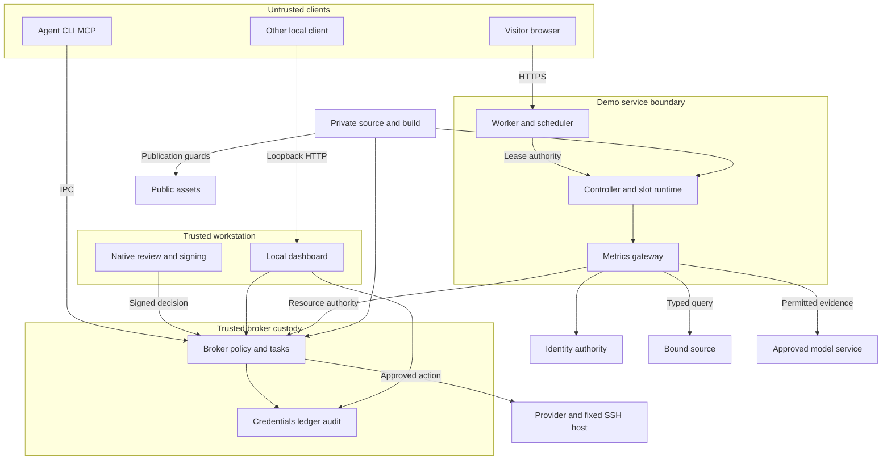

# Opaque threat model — 2026-09-09

**Working baseline for remediation; deployment facts remain unverified.** Private operator assessment; exclude from public routes, search, sitemaps, previews and assets. Snapshot: `e49b49e17aab4f1e73d42c8d6cce7b15de0bd711`, private `kcirtapfromspace/opaque-dogfood`. This supersedes no historical validation evidence and certifies no live deployment. Confirmed source defects and executed checks are recorded in the [security review](2026-09-09-security-review.md); execution order and closure criteria are in the [remediation plan](2026-09-09-security-remediation-plan.md).

## Executive summary

Opaque's strongest boundaries are its typed bounded tasks, durable consumption ledger, exact resource/tenant authorization and explicit approval bindings. The highest confirmed risk is in generic broker execution: caller-supplied policy targets and provider parameters can disagree, permitting an admitted agent to dispatch outside the destination policy. A second boundary weakness exposes the local dashboard bearer to unauthenticated loopback clients. Some public-demo JSON responses also outlive revoked leases. Production acceptance depends on independently protected broker/source/approver custody and verified cluster/model isolation; successful synthetic demo flows do not supply those guarantees.

## Scope and assumptions

- **Runtime scope:** `crates/opaque-core`, `opaqued`, `opaque`, `opaque-mcp`, `opaque-web`, `opaque-metrics`, `opaque-approver`, `opaque-approve-helper`; public edge and hosted-demo services under `deploy/`; bounded SSH host fixtures under `examples/bounded-ssh` as reference integrations. The iOS source is a scaffold and is not credited as an implemented transport.
- **Build/operator scope:** `.github/workflows`, `Cargo.lock`, `deny.toml`, `install.sh`, container/manifests, MkDocs and private/public publication boundaries. Relevant prior reviews and runbooks supply historical context, not current live-state assertions.
- **Assumed use:** Public Internet demo with synthetic source data; local or separated-custody broker intended for real secrets and bounded provider operations. Visitor prompts and support reasons may contain real user input even in a synthetic demo.
- **Assumed trust:** Agents, visitors and model proposals are untrusted. Operator-managed policy, broker and approver custody, host administrators and source data ownership are trusted. A different local OS user is not trusted merely because it shares loopback networking.
- **Not assessed:** Live cluster/network enforcement, current deployed images/configuration, actual customer data, production IdP enrollment, external source implementation, cloud account settings, hardware-backed ceremony, malicious host-root/broker-account compromise, full dependency-source audit or exhaustive fuzzing.
- **Assessment mode:** Source review and disposable local fixtures only; no provider mutations outside mocks, credential inspection, live service tests, publishing or product fixes.

After the assumption check-in, the user responded “Ok lets prepare to resolve issues” on September 9. Remediation preparation proceeds under the stated synthetic-demo plus planned-production scope and trusted host/broker-custody baseline. This is a working interpretation of that direction, not new evidence that a deployed system has those properties. The four confirmed code fixes do not require additional deployment answers to be prepared.

Before production acceptance, verify the actual provider credential breadth (TM-001), multi-user dashboard reachability (TM-002), confidential data and visitor-input handling (TM-003/TM-004/TM-009), and whether host/broker compromise must become an additional attacker capability. Source code cannot establish the actual exposure of the running environment. Changes to these facts require recalibrating the conditional ratings.

## System model

### Primary components

| Component | Role and evidence |
| --- | --- |
| CLI and MCP | Local request construction and stdio tool interface; MCP exposes a fixed safe-tool catalog. `crates/opaque/src/main.rs`; `crates/opaque-mcp/src/main.rs`, `tools.rs`. |
| Broker and core | Unix-socket peer/session authentication, policy, approval, credential-backed provider operations, tasks and audit. `crates/opaqued/src/main.rs`, `enclave.rs`, `task_api.rs`; `crates/opaque-core/src/{identity,policy,task,audit,resource_auth}.rs`. |
| Trusted approval clients/server | Native review/authentication and enrolled workstation signatures over full challenge/review. TLS pinning and private client custody. `crates/opaqued/src/approval.rs`, `approval_server/workstation.rs`; `crates/opaque-approver/src/{main,client,custody}.rs`. |
| Provider and host adapters | GitHub/Vault/other secret backends; approved fixed SSH/release operations. `crates/opaqued/src/{github,ssh.rs}`; `examples/bounded-ssh/{broker_control,host_guard}.py`. |
| Local dashboard | Loopback HTTP UI, direct selected audit/config reads and broker proxy under the dashboard identity. `crates/opaque-web/src/{main,security,daemon_client}.rs`, `routes/`. |
| Metrics gateway | Authenticated typed metrics/portfolio reads, grounded model interaction, bounded demo task/approval and organization views. Production authorization uses broker authority; local issuer/personas are fixture mode. `crates/opaque-metrics/src/{server,auth,metrics,chat,portfolio,bounded_demo,human_approval,approval_oauth,organization}.rs`. |
| Public Worker and scheduler | HTTPS browser entry, visitor cookie, Turnstile, durable global admission/capacity, lease/model/generation binding, fixed proxy routes. `deploy/cloudflare-demo/src/{http,queue,worker,models}.mjs`. |
| Hosted controller/runtime | Authenticated controller and per-lease runtime, constrained Kubernetes slot lifecycle, private persona cookies and loopback gateway/source/model bridge. `deploy/hosted-demo/{controller,runtime,credit_source,model_profiles}.py`, `k8s*.yaml`. |
| Build and publication | Rust locked dependencies; release signing and installer; private staging workflow; generated visitor documentation and deny-only privacy Worker. `.github/workflows/`; `Cargo.lock`; `install.sh`; `mkdocs.yml`; `deploy/cloudflare-docs-privacy/`. |

### Data flows and trust boundaries

- **B1 — Agent/CLI/MCP → broker:** JSON-framed Unix IPC crosses from untrusted process into credential custody. Socket permissions, peer identity, session/workload/principal resolution, schemas, policy and approval constrain requests. Parameters and policy targets remain separate on generic `execute`, creating TM-001. Initial frame admission lacks the later idle timeout. Evidence: `opaqued/src/main.rs:3191,3250,5472-5566`; `enclave.rs:830-893`.
- **B2 — Human/workstation → approval server → broker:** HTTPS carries enrollment challenges, exact review documents and signed approve/reject responses. Enrolled public keys, certificate pin, nonce, broker/request/operation/hash/expiry binding and post-review refetch establish authority. The workstation account and native UI remain trusted; signatures alone do not remotely attest human observation. Evidence: `opaque-approver/src/client.rs::BrokerClient`, `main.rs::run`; `opaque-core/src/workstation.rs`; `opaqued/src/approval_server/workstation.rs`.
- **B3 — Broker → secret/provider/SSH host:** Broker-held references resolve credentials for policy-approved operations; HTTPS adapters, pinned SSH host/CA and signed host-control messages constrain destination and intent. Typed tasks reserve durable allowance before dispatch and preserve unknown outcomes. Credential rights cap the ultimate effect. Evidence: `opaqued/src/github/mod.rs::handle_actions_secret`, `ssh.rs::execute_ssh_action`, `task_api.rs`; `opaque-core/src/task.rs`; `examples/bounded-ssh/host_guard.py`.
- **B4 — Local HTTP client → dashboard → private files/broker:** HTTP on loopback uses Host/Origin checks, a per-launch bearer and no-store headers. APIs access selected audit/config or the broker under dashboard identity. The unauthenticated bootstrap reveals that bearer; TCP loopback supplies no caller UID. Evidence: `opaque-web/src/security.rs:41-85`, `routes/mod.rs:32-34`, `routes/policy.rs`, `routes/audit.rs`, `daemon_client.rs`.
- **B5 — Internet visitor → Worker → durable scheduler:** HTTPS carries HMAC cookies, Turnstile responses, typed requests and task approval data. Exact origins, cookie shape/signature, fixed routes, body bounds, durable quotas and lease/generation/model checks constrain visitor authority. The browser does not receive backend credentials. Evidence: `deploy/cloudflare-demo/src/http.mjs`, `queue.mjs`; browser callback asset and HTTP tests.
- **B6 — Worker → controller → slot runtime/Kubernetes:** Authenticated private origin uses a controller service secret and per-lease runtime secret plus expiry/generation fences; fixed names/resources, image policies, resourceVersion and UID deletion checks protect slot transitions. Transport encryption and CNI isolation are deployment-dependent; internal plaintext/routability is documented. Evidence: `deploy/hosted-demo/controller.py`, `runtime.py`, `k8s-admission.yaml`, `OPERATIONS.md:307-315`.
- **B7 — Gateway/OAuth client → issuer/broker resource authority:** Production requests bind issuer, audience, tenant, subject, client and scopes, with current broker roles/delegation checked during use. Login uses code/PKCE/state/browser-cookie binding; resource JWT authority is distinct from ID-token login. Broker resource IPC authenticates socket owner/peer. Evidence: `opaque-metrics/src/server.rs:160-192,1410-1694`; `opaque-core/src/resource_auth.rs:329-450,1170-1298`.
- **B8 — Gateway → source/model → response consumer:** Typed bounded aggregate/portfolio queries and scoped evidence cross HTTP; source credentials/endpoints are operator-selected. Responses must match tenant/query/schema/freshness before disclosure. Models propose bounded tools/findings and cannot mint authority. Gateway output rechecks authorization during delivery, but outer demo JSON forwarding has a separate lease gap. Evidence: `opaque-metrics/src/metrics.rs:183-415`, `chat.rs`, `server.rs:2124-2259`; `deploy/cloudflare-demo/src/http.mjs:169-196`.
- **B9 — Agent-controlled workspace → broker Git verifier/sandbox:** Files, Git metadata and process inputs cross into privileged verification/secret-consuming subprocesses. Private reconstructed metadata, process/time/output bounds, custody separation and platform sandbox restrictions are critical. Agent-facing outputs omit secret-bearing process content. Evidence: `opaqued/src/main.rs::verify_workspace_blocking`, `workspace_process.rs`, `sandbox/`, `trust_domain.rs`; `opaque-mcp/src/main.rs:380-410`; previous private release review.
- **B10 — Dependencies/private source → CI artifacts/public site:** Crates, actions, container builds and Markdown become executable or published content. Cargo lock/advisory checks, repository/visibility guards, private staging destination IDs, site exclusions and a deny-only route Worker constrain the flow. Signature consumption, mutable action tags and enabled alternate public Git push paths remain operational dependencies. Evidence: `.github/workflows/{release,deploy-site,opaque-staging-release}.yml`; `install.sh`; `mkdocs.yml`; `deploy/cloudflare-docs-privacy/`.

#### Diagram

The gateway-to-broker edge represents production resource authority. Hosted demo fixture identities and local issuer are a separate mode; the diagram does not claim that the public synthetic demo uses production broker tenancy. The dashboard's Ledger edge includes selected config/audit reads, not direct access to every broker credential.

## Assets and security objectives

| Asset | Why it matters | Security objective (C/I/A) |
| --- | --- | --- |
| Provider/source credentials and private signing keys | Authorize writes, source reads, certificates and decisions beyond agent custody | C/I |
| Canonical destination and approved manifest | The human/policy target must equal the effect; no hidden repository/environment substitution | I |
| Tenant/resource/delegation authority | Prevent another subject, customer, client or revoked grant from acquiring access | C/I |
| Task/host consumption and outcome ledger | Replay, restart, cancellation and ambiguity must not create another allowance | I/A |
| Audit, policy, sessions and receipts | Sensitive operations/context must remain scoped, truthful and available for investigation | C/I/A |
| Source evidence, visitor prompts and support reasons | Protect confidential input and avoid attributing false/fresh data to a source | C/I |
| Approver application and review contents | Prevent approval spoofing or signing a different intent | I/C |
| Model/GPU, connection and queue capacity | One client must not consume unbounded shared work or release capacity before work stops | A/I |
| Private repository/operator documentation | Accidental public assets, previews and search indices can disclose internal architecture and records | C |
| Builds/installers and deployment specifications | Executable provenance and intended image/configuration must survive release and rollout | I |

## Attacker model

### Capabilities

- A remote visitor can reach the configured public Worker, create an admitted session when capacity/Turnstile permits, send arbitrary bounded JSON, issue concurrent requests, delay its own reads and race cancellation/expiry.
- An admitted local/delegated agent can call permitted raw IPC and wrapper operations, supply schemas/targets/parameters/workspace metadata, modify its own workspace and replay artifacts it legitimately sees. Model output can request invalid tools or propose adversarial queries.
- A different local OS account may reach loopback TCP while lacking owner-only files and the broker's permitted Unix identity.
- A compromised routable cluster workload can reach whatever service networking actually allows; this is a stronger, conditional attacker than a public browser. A compromised dependency/build action can run within its assigned build privileges.
- Network scheduling can delay, reorder or interrupt accepted operations and responses. Without a trusted channel failure, an attacker cannot simply forge TLS, signed broker decisions or provider credentials.

### Non-capabilities

- Visitors are not assumed to own the controller secret, runtime credentials, Kubernetes API rights or another lease's private persona cookies.
- Agents are not assumed to read or modify broker/approver custody, sealed policy, enrollment keys or the fixed host's root-owned configuration.
- Model proposals do not directly choose source credentials, customer databases, arbitrary URLs, SSH commands or expanded resource scopes.
- A successful OAuth login does not establish arbitrary production organization/tenant membership. Fixture persona selection is not production administration.
- This review did not establish host-root/kernel resistance, hardware attestation, encrypted internal demo transport, enforced CNI policy, independent audit completeness or globally exactly-once provider effects.

## Entry points and attack surfaces

| Surface | How reached | Trust boundary | Notes | Evidence (repo path / symbol) |
| --- | --- | --- | --- | --- |
| Raw broker RPC and wrappers | Unix socket from admitted process | B1/B3 | Generic destination mismatch; caller classification is server-derived | `opaqued/src/main.rs::handle_request`, `enclave.rs::execute` |
| Task plan/approve/run/revoke/read/reconcile | Authenticated broker API | B1/B2/B3 | Exact tenant/owner/delegation, immutable actions and durable slots | `opaqued/src/task_api.rs`; `opaque-core/src/task.rs` |
| Workstation/mobile/FIDO approval routes | Configured approval HTTPS listener | B2 | Pairing/enrollment and signed challenge validation; native app custody | `opaqued/src/approval_server.rs::build_router`; `approval_server/workstation.rs` |
| Web HTML/API/SSE | Local loopback HTTP | B4 | Bootstrap publicly carries bearer; direct config/audit access | `opaque-web/src/routes`, `security.rs` |
| MCP JSON-RPC stdio | Agent/tool host | B1 | Fixed catalog; Unicode error-path panic | `opaque-mcp/src/main.rs::handle_tools_call`, `tools.rs` |
| Public queue/workspace/session/activity/task/chat/approval routes | Worker HTTPS | B5/B6/B8 | Visitor cookie, durable admission, body schemas and response lifetime | `deploy/cloudflare-demo/src/http.mjs::handleRequest`, `queue.mjs` |
| Controller session/proxy/lifecycle endpoints | Worker/private control connection | B6 | Service credential, fixed lease ID/generation and slot controls | `deploy/hosted-demo/controller.py` |
| Runtime proxy/model bridge/source | Controller/per-lease and local processes | B6/B8 | Private cookies/secrets, fixed model paths, internal networking caveat | `deploy/hosted-demo/runtime.py`, `credit_source.py` |
| Gateway login/callback/resource/query/chat/organization/approval APIs | Authenticated browser or resource bearer | B7/B8 | Production broker authority, fixture identities, current disclosure checks | `opaque-metrics/src/server.rs`, `human_approval.rs`, `approval_oauth.rs` |
| Vault/GitHub/provider responses and SSH host evidence | Outbound provider operations | B3 | Typed validation, signer/host pins, uncertainty stays charged | `opaqued/src/github`, `ssh.rs`, `github/release.rs`; `examples/bounded-ssh/` |
| Workspace/Git/sandbox inputs | Agent filesystem/process | B9 | Hostile metadata and output around secret-consuming execution | `opaqued/src/workspace_process.rs`, `sandbox/`, `main.rs::verify_workspace_blocking` |
| Dependencies/workflows/installer/site generator | Developer and CI/operator actions | B10 | Provenance, public/private destinations, exclusions and generated output | `.github/workflows`; `install.sh`; `mkdocs.yml` |

Crate paths abbreviated in this table are under `crates/`. Operator-only env/config choices are not attributed to an unauthenticated visitor without an additional compromise prerequisite.

## Top abuse paths

### 1. Misrepresent the destination of a credential-backed action

1. An admitted agent selects a policy-allowed target and supplies different valid provider parameters.
2. Generic execution authorizes/displays the target, then the handler uses the parameters.
3. A broadly scoped provider credential applies the action to the unintended destination. **Confirmed SR-001; TM-001.**

### 2. Cross the dashboard's private-file boundary through loopback

1. A local client without owner-file access requests the dashboard bootstrap.
2. It receives the API bearer and presents it to policy/audit/task endpoints.
3. The dashboard releases data under its own filesystem/process authority. **Confirmed SR-002; TM-002.**

### 3. Receive data after the visitor lease closes

1. A visitor starts an activity/session read while authorized.
2. Cancellation or expiry occurs during upstream response collection.
3. The Worker returns the late JSON, which can include consented visitor text. **Confirmed SR-003; TM-003.**

### 4. Reuse or expand authority across an asynchronous operation

1. An agent/visitor replays an approval/token, changes a profile/query or races revocation during approval/execution.
2. It attempts a second source/provider dispatch or disclosure under stale tenant/intent authority.
3. Exact bindings, current resource checks and durable task slots should deny this; the generic policy path has weaker documented request-start semantics. **Controlled/residual scenario; TM-004/TM-005.**

### 5. Consume shared capacity outside an intended request budget

1. A local client with socket access withholds the first frame, or sends an invalid Unicode MCP tool name; a routable cluster peer can also target a model service directly if network isolation is absent.
2. Unauthenticated connections retain work capacity, the MCP session crashes, or model work bypasses the visitor scheduler.
3. Legitimate clients lose availability. Only the MCP panic was reproduced; socket saturation and cluster bypass remain conditional. **SR-004; TM-006/TM-009.**

### 6. Turn workspace verification or secret-consuming execution into an exfiltration path

1. An agent modifies Git metadata or subprocess inputs in its own workspace.
2. It tries to trigger broker-account execution or cause secret values to enter output/audit channels.
3. Safe metadata reconstruction, bounded subprocesses, custody and output suppression must contain this. Prior fixes exist; no new escape was confirmed here. **TM-007.**

### 7. Ship unreviewed code or private operator material

1. A compromised build dependency/action changes an artifact, or an operator chooses an incorrect publication destination/build configuration.
2. A trusted build/installer or public-site pipeline carries the unreviewed result across the private boundary.
3. Consumers receive compromised code or private records become public. Repository guards and generated-output exclusions reduce this risk; signature consumption and mutable references remain review targets. **TM-008.**

## Threat model table

Threats include confirmed findings and controlled/residual scenarios; a row is not automatically a vulnerability. Likelihood and impact are explained in each cell under the stated draft context.

| Threat ID | Threat source | Prerequisites | Threat action | Impact | Impacted assets | Existing controls (evidence) | Gaps | Recommended mitigations | Detection ideas | Likelihood | Impact severity | Priority |
| --- | --- | --- | --- | --- | --- | --- | --- | --- | --- | --- | --- | --- |
| TM-001 | Admitted agent | Generic provider operation allowed; credential spans destinations | Authorize a decoy target and execute parameter destination | Unauthorized provider destination/write | Secrets; intent; audit integrity | Peer/session checks, schema and derived refs (`main.rs:5472-5566`; `enclave.rs:848-893`) | Target and parameters are independent; SR-001 reproduced | One typed action derives policy/review/audit/provider fields; reject conflicts before credential use | Fixed mismatch reason; canonical provider-target correlation | medium — requires admitted caller and broader provider credential, then deterministic | high — secret publication or destructive action can cross intended repository/environment | high |
| TM-002 | Other local OS client | Dashboard running and same loopback reachable | Retrieve bootstrap bearer, read APIs | Private context disclosed through owner process | Audit; policy; sessions/tasks | Host/Origin/no-store; 0600 token (`opaque-web/src/security.rs`) | HTML exposes bearer without owner proof; SR-002 reproduced without UID switch | Separate single-use owner bootstrap/session; protect all data routes | Auth failures; owner-capability issuance/consumption events | medium — straightforward on shared hosts; lower on isolated single-user systems | medium — scoped operator data, no demonstrated arbitrary writes | medium |
| TM-003 | Lease holder or delayed traffic | Valid request accepted before lease closes | Collect late session/activity JSON | Disclosure after expiry/cancellation | Visitor input; support/session metadata | Final checks for tasks/chat (`http.mjs:169-177,253-263`) | Generic JSON skips final scheduler check; SR-003 reproduced | Reauthorize after bounded body collection; compare lease generation; never redispatch mutation | Static late-disclosure denial counter | medium — boundary race reproduced using delay; no fresh expired request admitted | low — current single-lease synthetic app, with possible real visitor text; rises with confidential tenants | low |
| TM-004 | Agent/model or stolen resource token | Token/subject access or adversarial model response | Expand tenant, source, query or model disclosure | Cross-customer data or unauthorized inference disclosure | Source data; resource authority; prompts | Broker production mode, exact claims/admission, typed source/query/freshness, delivery rechecks (`resource_auth.rs`; metrics `server.rs`, `metrics.rs`) | Source ownership, issuer deployment and model custody are external dependencies; no bypass found | Validate two actual tenant/source identities; preserve scope checks before every effect and delivery | Structured denied tenant/client/scope/query reasons; no prompt/token logging | low — implementation controls reject the tested expansions | high — real tenant-data exposure if a required external boundary fails | medium |
| TM-005 | Agent replaying/racing approvals | Observed approval/task artifact; delay or identity change | Reuse allowance or execute/disclose after revocation | Excess provider actions; misleading receipts | Approval keys/intent; durable ledger | Full challenge/review binding, post-review fetch, task owner/delegation/policy rechecks, durable slots and charged unknowns (`workstation.rs`; `task_api.rs`; `task.rs`; `ssh.rs`) | Generic policy explicitly finishes evaluated requests under old rules (`enclave.rs:744-747`); host cleanup depends on transport | Preserve typed task protections; specify and enforce immediate revocation where required; retain provider outcome uncertainty | Replay/reservation conflicts; unknown outcomes; host revoke acknowledgement separately | low — bounded task controls substantially restrict replay | high — provider side effects cannot be assumed reversible | medium |
| TM-006 | Local socket/MCP client; exposed login client | Endpoint reachability | Occupy pre-auth work or crash MCP error path | Service/session denial | Connection and agent capacity | 64 broker connections, post-handshake idle timeout; gateway pending cap; body limits | First-frame wait before timeout; metadata egress before login cap; byte-slice panic confirmed SR-004 | Bound handshake and unauth requests; reserve before egress; Unicode-safe errors | Handshake age/capacity; login egress rate; MCP abnormal exits | medium — MCP panic deterministic; saturation/external login impact unmeasured | low — demonstrated single MCP session; broker-wide impact conditional | low |
| TM-007 | Workspace-controlling agent | Agent can modify its workspace and call relevant operations | Abuse Git/process parsing or secret-bearing output | Broker-context execution or secret leakage | Broker credentials; output/audit integrity | Private Git metadata, bounded process runner, output suppression, platform custody/sandbox controls (`workspace_process.rs`; `sandbox/`; MCP `main.rs:380-410`) | Platform/kernel and separate-UID enforcement were not rerun; same-owner processes remain trusted | Retain hostile-file/filter/process/output regressions; validate actual separate-UID Linux custody before sensitive use | Fixed workspace rejection codes; sandbox/output suppression events | low — prior concrete fixes present; no new bypass found | high — a failed custody boundary exposes all reachable broker credentials | medium |
| TM-008 | Compromised dependency/action or mistaken operator | Build/publication or release-distribution authority | Alter executable provenance or publish private content | Consumer compromise; internal records public | Build integrity; private repository/docs | Lock/advisory checks, explicit repo/visibility/ID guards, exclusions, generated-site scan (`.github/workflows`; `mkdocs.yml`) | Mutable action tags; opportunistic/incomplete signature consumption; alternate public push remote; live settings unverified | Pin privileged actions; test exact-identity bundle verification; enforce output scans in CI; remove public push routes | Artifact identity/digest checks; private-content build guard; visibility changes | low — needs supply-chain or operator authority; current site checks passed | high — installed broker compromise or irreversible public disclosure | medium |
| TM-009 | Compromised routable cluster peer/controller | Internal network access or Kubernetes creation authority | Bypass model budgets or alter slot execution through unguarded configuration | Capacity abuse; confidential prompt/custody compromise if sensitive use | GPU/model; runtime/controller secrets; prompts | Fixed slot names/image templates, lease/generation/UID fences, admission/RBAC (`controller.py`; `k8s-admission.yaml`) | Runbook records unverified CNI, plaintext/internal models and shared custody; lifecycle/probe constraints unvalidated | Keep synthetic/public-only; demonstrate network isolation/authenticated model transport; constrain hooks/probes and pre-auth runtime work | Per-origin model calls versus scheduler counters; rejected pod fields; unexpected service connections | medium — network exposure documented, exploitation not exercised; stronger than browser attacker | medium — synthetic demo availability today; high if confidential processing is added | medium |

Unqualified Rust paths in table cells refer to the matching component under `crates/`; line-specific confirmed evidence is expanded in the security review. Threat priorities are work-planning priorities, distinct from confirmed P1–P3 defect severities.

## Criticality calibration

- **Critical:** Broad credential/key compromise reachable without an existing privileged foothold; an unauthenticated arbitrary broker-account execution path; a reproducible production cross-tenant exfiltration path with broad exposure. None was established here.
- **High:** An admitted agent can send a privileged action to an unapproved provider destination; approval reuse permits irreversible writes; a verified custody escape releases broker secrets. TM-001 meets the destination-policy case when provider rights span destinations.
- **Medium:** Another local user reads private dashboard context; an exposed service can be denied to other users under realistic limits; a failed deployment/source/model boundary could expose scoped confidential evidence. Residual scenarios require their stated prerequisites and are not all confirmed medium defects.
- **Low:** A malformed tool call terminates only its own MCP session; one previously authorized demo response arrives just after expiry; metadata-only leakage under low-sensitivity constraints. Synthetic data reduces content impact but does not excuse misleading security guarantees.

Likelihood is high for a broadly reachable, repeatable action with few prerequisites; medium when admission, timing or internal reachability is needed; low when strong controls remain and an additional trust failure is required. No rating assumes that possession of a stolen credential alone proves an implementation vulnerability.

## Focus paths for security review

| Path | Why it matters | Related Threat IDs |
| --- | --- | --- |
| `crates/opaqued/src/main.rs` | Raw RPC construction, socket admission and workspace verification join several trust boundaries | TM-001, TM-006, TM-007 |
| `crates/opaqued/src/enclave.rs` | Canonical policy input, approval text and dispatch/current-policy semantics | TM-001, TM-005 |
| `crates/opaqued/src/github/mod.rs` | Actual secret destination derives from operation parameters | TM-001 |
| `crates/opaque-core/src/policy.rs` | Destination and secret-reference matches must use authoritative data | TM-001, TM-005 |
| `crates/opaqued/src/task_api.rs` | Owner/delegation/profile and current-state gates around durable execution | TM-005 |
| `crates/opaque-core/src/task.rs` | Reservation, restart, receipts and unknown-outcome accounting | TM-005 |
| `crates/opaqued/src/ssh.rs` | Certificate validation, fixed host action and evidence release | TM-005 |
| `examples/bounded-ssh/` | Independent signed admission, revocation and fixed command enforcement | TM-005 |
| `crates/opaque-approver/src/` | Private key custody, exact TLS pin and post-review validation | TM-005 |
| `crates/opaqued/src/approval_server/` | Enrollment and signed decision verification | TM-005, TM-006 |
| `crates/opaque-web/src/` | Unauthenticated credential bootstrap and owner-identity data access | TM-002 |
| `crates/opaque-mcp/src/main.rs` | Untrusted JSON errors and model-visible output projection | TM-006, TM-007 |
| `crates/opaque-core/src/resource_auth.rs` | Exact resource authority and authenticated broker IPC | TM-004 |
| `crates/opaque-metrics/src/server.rs` | Login, source/model execution and queued response authorization | TM-003, TM-004, TM-006 |
| `crates/opaque-metrics/src/metrics.rs` | Tenant/query/source evidence validation before release | TM-004 |
| `crates/opaque-metrics/src/organization.rs` | Visitor text sharing, persona generation and sensitive activity projection | TM-003, TM-004 |
| `crates/opaque-metrics/src/human_approval.rs` | Task-bound WebAuthn ceremony and approval lifecycle | TM-005 |
| `crates/opaqued/src/workspace_process.rs` | Hostile metadata/process lifetime and output bounds | TM-007 |
| `crates/opaqued/src/sandbox/` | Secret-consuming process containment and platform differences | TM-007 |
| `deploy/cloudflare-demo/src/http.mjs` | Final visitor lease checks across every protected output branch | TM-003 |
| `deploy/cloudflare-demo/src/queue.mjs` | Durable capacity, generation and uncertain execution fences | TM-003, TM-009 |
| `deploy/hosted-demo/controller.py` | Slot lifecycle, backend authentication and final response forwarding | TM-003, TM-009 |
| `deploy/hosted-demo/runtime.py` | Per-lease custody, private persona routing and connection capacity | TM-003, TM-009 |
| `deploy/hosted-demo/k8s-admission.yaml` | Exact admitted pod specification including command-bearing hooks/probes | TM-009 |
| `.github/workflows/` | Build privilege, destination/visibility guards and action provenance | TM-008 |
| `install.sh` | Artifact integrity and release signer identity consumption | TM-008 |
| `mkdocs.yml` | Generated route/search/asset exclusions for internal documents | TM-008 |
| `deploy/cloudflare-docs-privacy/` | Public-host deny routes complement actual build exclusions | TM-008 |

## Notes on use

- Treat SR-001/SR-002 as immediate remediation work before relying on these affected paths with production authority. Keep the demo's sensitivity constraints until independent deployment/source checks pass.
- Existing controls are evidence-backed implementation features; recommendations are future work. A historical runbook result, template, signature, test or clean advisory scan is not proof of current deployment isolation or complete audit evidence.
- The security review records 250 passing existing tests (one ignored), isolated defect reproductions, current advisory scan and the 74-file generated-site inspection. Coverage is focused, not exhaustive. No raw session artifacts or credentials belong in this repository.
- **Quality check:** discovered entry-point families are listed; B1–B10 appear in the threat rows; runtime, fixture, CI and operator authority are distinguished; the assumption check-in, subsequent remediation direction and remaining deployment questions are explicit; confirmed defects are separated from controlled/residual threats; Mermaid uses a conservative flowchart format.
- **Remediation status:** all four confirmed findings remain open. Track implementation, independent review and deployment evidence in the remediation plan. Recalibrate this model when actual deployment facts change; completing code fixes alone does not close the external production gates.
